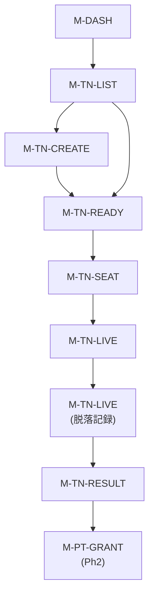
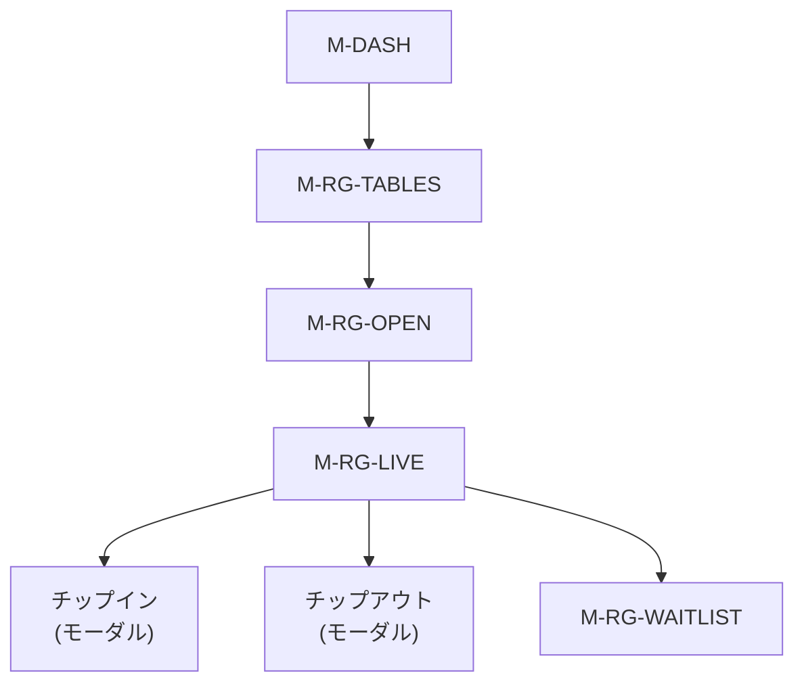
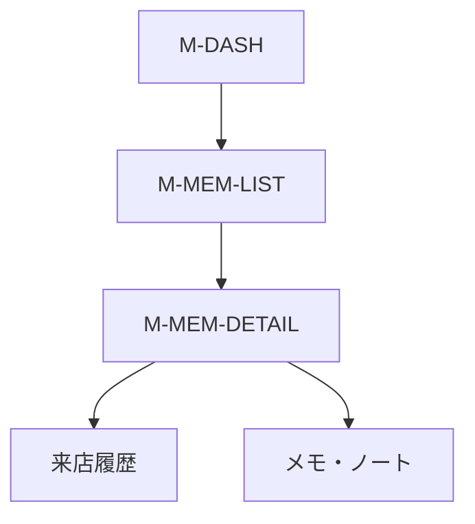

# PGOS Manager — 店舗管理Webアプリ UX設計

## 対象

- **アプリ**: PGOS Manager（Web レスポンシブ、タブレット最適化）
- **ユーザー**: 店舗オペレーター、イベント主催者
- **フェーズ**: Phase 1 (MVP) + Phase 2 (拡張)

---

## ナビゲーション構造

### レイアウト

```
┌──────────┬──────────────────────────────────────┐
│          │  ヘッダー: 店舗名 ▼  🔔 通知  👤 ユーザー  │
│  サイド   ├──────────────────────────────────────┤
│  バー    │                                      │
│          │                                      │
│ Dashboard│         コンテンツエリア                 │
│ ─────── │                                      │
│ Tournament                                      │
│ Ring Game│                                      │
│ Members  │                                      │
│ Staff    │                                      │
│ ─────── │                                      │
│ Points◆  │                                      │
│ Reports◆ │                                      │
│ Store◆   │                                      │
│ ─────── │                                      │
│ Settings │                                      │
│          │  ◆ = Phase 2                         │
└──────────┴──────────────────────────────────────┘
```

- デスクトップ: サイドバー展開表示（アイコン + テキスト）
- タブレット: サイドバーアイコンのみ（ホバーで展開）
- サイドバーのセクションは機能グループで区切り線

### ヘッダー

- 店舗名（複数店舗管理時はドロップダウンで切替）
- 通知ベル（未読数バッジ）
- ユーザーメニュー（アカウント設定、ログアウト）

---

## 画面フロー

### トーナメント運営フロー



### リングゲーム運営フロー



### 会員管理フロー



---

## Phase 1 画面定義

### M-LOGIN — ログイン

| 項目 | 内容 |
|------|------|
| **画面ID** | M-LOGIN |
| **要件ID** | C4-1-01, C4-1-03 |
| **目的** | 店舗スタッフの認証（2FA対応） |

```
┌──────────────────────────────┐
│                              │
│          PGOS Manager        │
│                              │
│   メールアドレス               │
│   ┌────────────────────────┐ │
│   │                        │ │
│   └────────────────────────┘ │
│   パスワード                  │
│   ┌────────────────────────┐ │
│   │                        │ │
│   └────────────────────────┘ │
│                              │
│       [ログイン]              │
│                              │
│   パスワードを忘れた方 >       │
│                              │
└──────────────────────────────┘
```

**ログイン後フロー:**
- 2FA 有効 → 認証コード入力画面 → M-DASH
- 2FA 無効 → M-DASH

---

### M-DASH — ダッシュボード

| 項目 | 内容 |
|------|------|
| **画面ID** | M-DASH |
| **要件ID** | — |
| **目的** | 店舗の今日の状況を一目で把握するハブ画面 |

```
┌──────────┬──────────────────────────────────────┐
│          │  店舗A ▼         🔔 3   👤 スタッフA   │
│ Dashboard├──────────────────────────────────────┤
│ ━━━━━━━ │                                      │
│ Tournament  ダッシュボード                         │
│ Ring Game│                                      │
│ Members  │  ┌──────┐ ┌──────┐ ┌──────┐ ┌──────┐│
│ Staff    │  │来店者数 │ │稼働TBL│ │待ち人数│ │本日売上││
│          │  │  24   │ │  3   │ │  5   │ │¥186k ││
│ Settings │  └──────┘ └──────┘ └──────┘ └──────┘│
│          │                                      │
│          │  ── 今日のイベント ─────────────────   │
│          │  🏆 19:00 デイリーNLH                  │
│          │     エントリー 12/36  [管理 >]          │
│          │  🏆 21:00 ディープスタック               │
│          │     エントリー 5/24   [管理 >]          │
│          │                                      │
│          │  ── テーブル状況 ────────────────────  │
│          │  ┌────────┬────────┬────────┐        │
│          │  │NLH 1-2 │NLH 2-5 │PLO 2-5 │        │
│          │  │T1: 8/9 │T2: 6/9 │T3:CLOSE│        │
│          │  │待ち: 3  │待ち: 0  │        │        │
│          │  └────────┴────────┴────────┘        │
│          │                                      │
│          │  ── 最近のアクティビティ ──────────────  │
│          │  14:32 プレイヤーX チェックイン           │
│          │  14:28 T1 チップイン ¥10,000           │
│          │  14:15 プレイヤーY ウェイティング登録      │
│          │                                      │
└──────────┴──────────────────────────────────────┘
```

**リアルタイム更新:**
- 来店者数、テーブル状況、待ち人数は WebSocket でリアルタイム反映
- アクティビティログは新しい項目が上に追加

---

### M-TN-LIST — トーナメント一覧

| 項目 | 内容 |
|------|------|
| **画面ID** | M-TN-LIST |
| **要件ID** | B1-1-01 |
| **目的** | トーナメントの一覧表示・管理 |

```
┌──────────┬──────────────────────────────────────┐
│          │  トーナメント一覧        [+ 新規作成]    │
│ Tournament├─────────────────────────────────────┤
│ ━━━━━━━ │                                      │
│          │  [今日] [今週] [すべて]   🔍 検索       │
│          │                                      │
│          │  ── 今日 3/14 ──────────────────────  │
│          │  ┌────────────────────────────────┐  │
│          │  │🏆 デイリーNLH                     │  │
│          │  │ 19:00  ¥3,000  参加 12/36       │  │
│          │  │ ステータス: 受付中                 │  │
│          │  │              [管理 >]            │  │
│          │  ├────────────────────────────────┤  │
│          │  │🏆 ディープスタック                 │  │
│          │  │ 21:00  ¥5,000  参加 5/24        │  │
│          │  │ ステータス: 受付中                 │  │
│          │  │              [管理 >]            │  │
│          │  └────────────────────────────────┘  │
│          │                                      │
│          │  ── 3/15 ──────────────────────────  │
│          │  ┌────────────────────────────────┐  │
│          │  │🏆 サンデー杯                      │  │
│          │  │ 13:00  ¥8,000  参加 8/48        │  │
│          │  │              [管理 >]            │  │
│          │  └────────────────────────────────┘  │
│          │                                      │
└──────────┴──────────────────────────────────────┘
```

---

### M-TN-CREATE — トーナメント作成/編集

| 項目 | 内容 |
|------|------|
| **画面ID** | M-TN-CREATE |
| **要件ID** | B1-1-01〜B1-1-06, B1-5-01〜B1-5-02, B1-6-01 |
| **目的** | トーナメントの作成・編集（ストラクチャー・ペイアウト設定含む） |

```
┌──────────┬──────────────────────────────────────┐
│          │  ← トーナメント作成    [下書き保存] [公開] │
│          ├──────────────────────────────────────┤
│          │                                      │
│          │  ── 基本情報 ────────────────────────  │
│          │  トーナメント名                         │
│          │  ┌────────────────────────────────┐  │
│          │  │ デイリーNLH                      │  │
│          │  └────────────────────────────────┘  │
│          │  日時           ゲーム種別              │
│          │  ┌────────────┐ ┌──────────────────┐│
│          │  │3/14 19:00  │ │NLH          ▼   ││
│          │  └────────────┘ └──────────────────┘│
│          │  エントリー費     定員                  │
│          │  ┌────────────┐ ┌──────────────────┐│
│          │  │¥3,000      │ │36                ││
│          │  └────────────┘ └──────────────────┘│
│          │  リバイ          アドオン               │
│          │  ┌────────────┐ ┌──────────────────┐│
│          │  │¥2,000      │ │—                 ││
│          │  └────────────┘ └──────────────────┘│
│          │  レイトレジ: Lv [6 ▼] まで            │
│          │  マルチデイ: ☐                        │
│          │                                      │
│          │  ── ストラクチャー ──────────────────  │
│          │  テンプレート: [デイリー標準 ▼] [新規作成] │
│          │  ┌───┬──────┬──────┬──────┐         │
│          │  │Lv │SB/BB │Ante  │時間  │         │
│          │  ├───┼──────┼──────┼──────┤         │
│          │  │ 1 │100/200│  0   │20分 │         │
│          │  │ 2 │200/400│  0   │20分 │         │
│          │  │ B │Break │      │10分 │         │
│          │  │ 3 │300/600│ 100  │20分 │         │
│          │  │...│      │      │     │         │
│          │  └───┴──────┴──────┴──────┘         │
│          │  [+ レベル追加] [+ ブレイク追加]         │
│          │                                      │
│          │  ── ペイアウト ─────────────────────  │
│          │  テンプレート: [標準20% ▼]              │
│          │  1位: 40%  2位: 25%  3位: 15% ...   │
│          │  [カスタマイズ >]                       │
│          │                                      │
│          │  ⚠ エントリー費が税別10万円を超えています │
│          │    (コンプライアンス: CL-3-01)           │
│          │                                      │
└──────────┴──────────────────────────────────────┘
```

**バリデーション:**
- エントリー費+リバイ+アドオンの合計が税別10万円超 → 警告表示 (CL-3-01)
- ストラクチャー未設定 → 公開不可

---

### M-TN-READY — トーナメント準備/受付

| 項目 | 内容 |
|------|------|
| **画面ID** | M-TN-READY |
| **要件ID** | B1-3-01〜B1-3-06 |
| **目的** | 参加者の確認・追加登録、開始準備 |

```
┌──────────┬──────────────────────────────────────┐
│          │  🏆 デイリーNLH  19:00              │
│          │  ステータス: 受付中    [トーナメント開始]  │
│          ├──────────────────────────────────────┤
│          │                                      │
│          │  参加者: 18名 / 36名                   │
│          │                                      │
│          │  [+ 参加者を追加]  [QR読取]             │
│          │                                      │
│          │  ┌──┬────────┬──────┬────┬──────┐   │
│          │  │# │名前     │支払い │状態 │操作   │   │
│          │  ├──┼────────┼──────┼────┼──────┤   │
│          │  │1 │プレイヤーA│現金  │受付済│ ✕    │   │
│          │  │2 │プレイヤーB│ポイント│受付済│ ✕   │   │
│          │  │3 │プレイヤーC│現金  │事前 │確認   │   │
│          │  │4 │ゲスト1   │現金  │受付済│ ✕    │   │
│          │  │..│        │      │    │      │   │
│          │  └──┴────────┴──────┴────┴──────┘   │
│          │                                      │
│          │  ── 集計 ──────────────────────────  │
│          │  現金: ¥42,000  ポイント: ¥12,000     │
│          │  リバイ: 3件 ¥6,000                   │
│          │                                      │
└──────────┴──────────────────────────────────────┘
```

**アクション:**
- 「トーナメント開始」→ テーブル抽選確認 → M-TN-SEAT → M-TN-LIVE
- 「参加者を追加」→ プレイヤー検索モーダル（PGOS会員 or ゲスト）
- 「QR読取」→ プレイヤーのQRコードを読み取って追加
- 参加者行の「✕」→ キャンセル確認ダイアログ

---

### M-TN-LIVE — トーナメント進行中

| 項目 | 内容 |
|------|------|
| **画面ID** | M-TN-LIVE |
| **要件ID** | B1-2-01〜B1-2-09, B1-3-04, B1-4-01〜B1-4-05 |
| **目的** | トーナメント進行の管理（クロック制御、脱落記録、テーブル管理） |

```
┌──────────┬──────────────────────────────────────┐
│          │  🏆 デイリーNLH  進行中                 │
│          ├──────────────────────────────────────┤
│          │                                      │
│          │  ┌──────────────────────────────┐    │
│          │  │  Lv4  400/800  Ante: 100     │    │
│          │  │       残り 12:34             │    │
│          │  │  [⏸一時停止] [⏭次へ] [⏮戻る] │    │
│          │  │  残り: 14名  平均: 28,500     │    │
│          │  └──────────────────────────────┘    │
│          │                                      │
│          │  [テーブル] [参加者] [ペイアウト] [ログ]  │
│          │                                      │
│          │  ── テーブル ────────────────────────  │
│          │  テーブル1 (6名)     テーブル2 (8名)    │
│          │  ┌──────────────┐ ┌──────────────┐  │
│          │  │S1: プレイヤーA │ │S1: プレイヤーE │  │
│          │  │S2: プレイヤーB │ │S2: プレイヤーF │  │
│          │  │S3: (空席)     │ │S3: プレイヤーG │  │
│          │  │S4: プレイヤーC │ │S4: プレイヤーH │  │
│          │  │S5: プレイヤーD │ │...            │  │
│          │  │S6: ゲスト1    │ │               │  │
│          │  └──────────────┘ └──────────────┘  │
│          │                                      │
│          │  ⚠ テーブルバランス推奨: T2→T1に1名移動  │
│          │  [バランス実行]                         │
│          │                                      │
│          │  ── 脱落記録 ──────────────────────── │
│          │  [脱落を記録] ← プレイヤー選択ドロップダウン│
│          │  最終脱落: 14:45 プレイヤーZ (15位)     │
│          │                                      │
└──────────┴──────────────────────────────────────┘
```

**リアルタイム:**
- クロックのカウントダウンは画面上でリアルタイム表示
- PGOS Clock と同期
- 脱落記録時に順位を自動計算

**アクション:**
- 「脱落を記録」→ プレイヤー選択 → 順位自動確定
- 「バランス実行」→ 移動するプレイヤーと移動先を確認 → 実行
- テーブルの「ブレイク」→ テーブル統合フロー
- 残り人数がペイアウト圏内到達 → ペイアウト開始可能の通知

---

### M-TN-RESULT — トーナメント結果

| 項目 | 内容 |
|------|------|
| **画面ID** | M-TN-RESULT |
| **要件ID** | B1-5-01〜B1-5-05 |
| **目的** | トーナメント結果の確認・ペイアウト確定 |

```
┌──────────┬──────────────────────────────────────┐
│          │  🏆 デイリーNLH  結果                   │
│          ├──────────────────────────────────────┤
│          │                                      │
│          │  参加者: 24名  リバイ: 8   プール: ¥100k│
│          │                                      │
│          │  ── 入賞者 ──────────────────────────  │
│          │  ┌──┬────────┬──────┬───────────┐    │
│          │  │順│名前     │配分%  │ポイント(Ph2)│    │
│          │  ├──┼────────┼──────┼───────────┤    │
│          │  │1 │プレイヤーA│40%   │4,000 pt   │    │
│          │  │2 │プレイヤーB│25%   │2,500 pt   │    │
│          │  │3 │プレイヤーC│15%   │1,500 pt   │    │
│          │  │4 │プレイヤーD│10%   │1,000 pt   │    │
│          │  │5 │ゲスト1   │ 5%   │— (未契約)  │    │
│          │  │6 │プレイヤーE│ 3%   │  300 pt   │    │
│          │  │7 │プレイヤーF│ 2%   │  200 pt   │    │
│          │  └──┴────────┴──────┴───────────┘    │
│          │                                      │
│          │  [結果を確定]  [ペイアウトを編集]         │
│          │  [ポイント付与リクエスト送信 (Ph2)]       │
│          │                                      │
└──────────┴──────────────────────────────────────┘
```

---

### M-STR-LIST — ストラクチャー管理

| 項目 | 内容 |
|------|------|
| **画面ID** | M-STR-LIST |
| **要件ID** | B1-1-01〜B1-1-04 |
| **目的** | ストラクチャーテンプレートの一覧・管理 |

```
┌──────────┬──────────────────────────────────────┐
│          │  ストラクチャー管理      [+ 新規作成]    │
│          ├──────────────────────────────────────┤
│          │                                      │
│          │  ┌──────────┬────────┬──────┬──────┐│
│          │  │テンプレート名│レベル数 │総時間 │操作  ││
│          │  ├──────────┼────────┼──────┼──────┤│
│          │  │デイリー標準 │ 12    │3h30m│ 編集 ││
│          │  │ディープ    │ 18    │5h   │ 編集 ││
│          │  │ターボ     │  8    │2h   │ 編集 ││
│          │  │PLO標準    │ 10    │3h   │ 編集 ││
│          │  └──────────┴────────┴──────┴──────┘│
│          │                                      │
│          │  [インポート (JSON/CSV)]                │
│          │  [エクスポート]                         │
│          │                                      │
└──────────┴──────────────────────────────────────┘
```

---

### M-RG-TABLES — リングゲーム テーブル一覧

| 項目 | 内容 |
|------|------|
| **画面ID** | M-RG-TABLES |
| **要件ID** | B2-1-01〜B2-1-05 |
| **目的** | リングゲームテーブルの状況一覧と管理 |

```
┌──────────┬──────────────────────────────────────┐
│          │  リングゲーム             [+ テーブル追加]│
│ Ring Game├──────────────────────────────────────┤
│ ━━━━━━━ │                                      │
│          │  ── 稼働中 ──────────────────────────  │
│          │  ┌──────────────────────────────┐    │
│          │  │ NLH 1-2  テーブル1             │    │
│          │  │ 着席: 8/9  待ち: 3人           │    │
│          │  │ 稼働時間: 4h 20m               │    │
│          │  │ [管理 >]     [クローズ]         │    │
│          │  ├──────────────────────────────┤    │
│          │  │ NLH 2-5  テーブル2             │    │
│          │  │ 着席: 6/9  待ち: 0人           │    │
│          │  │ 稼働時間: 2h 45m               │    │
│          │  │ [管理 >]     [クローズ]         │    │
│          │  └──────────────────────────────┘    │
│          │                                      │
│          │  ── クローズ中 ────────────────────── │
│          │  ┌──────────────────────────────┐    │
│          │  │ PLO 2-5  テーブル3             │    │
│          │  │ [オープン]                      │    │
│          │  └──────────────────────────────┘    │
│          │                                      │
└──────────┴──────────────────────────────────────┘
```

---

### M-RG-LIVE — リングゲーム テーブル管理

| 項目 | 内容 |
|------|------|
| **画面ID** | M-RG-LIVE |
| **要件ID** | B2-2-01〜B2-2-05, B2-3-01〜B2-3-06 |
| **目的** | 稼働中テーブルの着席者管理、チップイン/アウト |

```
┌──────────┬──────────────────────────────────────┐
│          │  ← NLH 1-2  テーブル1                  │
│          ├──────────────────────────────────────┤
│          │                                      │
│          │  [着席状況] [ウェイティング] [セッション]   │
│          │                                      │
│          │  ── 着席状況 ────────────────────────  │
│          │  ┌──┬────────┬──────┬──────┬──────┐ │
│          │  │席│名前     │チップ │時間  │操作   │ │
│          │  ├──┼────────┼──────┼──────┼──────┤ │
│          │  │1 │プレイヤーA│32,000│2h15m│[OUT] │ │
│          │  │2 │プレイヤーB│18,500│1h40m│[OUT] │ │
│          │  │3 │プレイヤーC│45,200│3h05m│[OUT] │ │
│          │  │4 │(空席)   │      │     │[IN]  │ │
│          │  │5 │プレイヤーD│ 8,000│0h25m│[OUT] │ │
│          │  │..│        │      │     │      │ │
│          │  └──┴────────┴──────┴──────┴──────┘ │
│          │                                      │
│          │  [+ チップ追加]  (選択したプレイヤーに)   │
│          │                                      │
│          │  ── テーブル合計 ─────────────────────  │
│          │  着席: 8/9  合計チップ: 185,700        │
│          │                                      │
│          │  ⚠ 遊技チップ＝ポイント等価チェック OK    │
│          │                                      │
└──────────┴──────────────────────────────────────┘
```

**モーダル: チップイン**
```
┌────────────────────────┐
│  チップイン        ✕    │
├────────────────────────┤
│  プレイヤー: [選択 ▼]   │
│  席番号:    [4 ▼]      │
│  チップ額:              │
│  ┌────────────────────┐│
│  │ ¥10,000            ││
│  └────────────────────┘│
│  支払い: ○現金 ○ポイント │
│                        │
│  [チップイン確定]        │
└────────────────────────┘
```

**モーダル: チップアウト**
```
┌────────────────────────┐
│  チップアウト       ✕    │
├────────────────────────┤
│  プレイヤーA             │
│  チップイン: ¥30,000     │
│  現在チップ: 32,000      │
│  プレイ時間: 2h 15m     │
│                        │
│  チップアウト額:          │
│  ┌────────────────────┐│
│  │ 32,000             ││
│  └────────────────────┘│
│                        │
│  [チップアウト確定]       │
└────────────────────────┘
```

---

### M-RG-WAITLIST — ウェイティングリスト

| 項目 | 内容 |
|------|------|
| **画面ID** | M-RG-WAITLIST |
| **要件ID** | B2-2-01〜B2-2-05 |
| **目的** | リングゲームのウェイティングリスト管理 |

```
┌──────────┬──────────────────────────────────────┐
│          │  ← ウェイティングリスト  NLH 1-2        │
│          ├──────────────────────────────────────┤
│          │                                      │
│          │  待ち: 3名                             │
│          │                                      │
│          │  ┌──┬────────┬──────┬─────┬──────┐  │
│          │  │# │名前     │登録方法│時間  │操作   │  │
│          │  ├──┼────────┼──────┼─────┼──────┤  │
│          │  │1 │プレイヤーE│アプリ │15分前│[案内] │  │
│          │  │2 │プレイヤーF│店頭  │10分前│[案内] │  │
│          │  │3 │プレイヤーG│アプリ │3分前 │[案内] │  │
│          │  └──┴────────┴──────┴─────┴──────┘  │
│          │                                      │
│          │  [+ 店頭登録]                          │
│          │                                      │
│          │  「案内」→ プレイヤーに通知 + チップイン画面│
│          │                                      │
└──────────┴──────────────────────────────────────┘
```

---

### M-MEM-LIST — 会員一覧

| 項目 | 内容 |
|------|------|
| **画面ID** | M-MEM-LIST |
| **要件ID** | B3-1-01〜B3-1-04, B3-2-01〜B3-2-05 |
| **目的** | 会員の一覧表示・検索 |

```
┌──────────┬──────────────────────────────────────┐
│          │  会員管理                              │
│ Members  ├──────────────────────────────────────┤
│ ━━━━━━━ │                                      │
│          │  🔍 名前・IDで検索                      │
│          │  種別: [全て ▼]  eKYC: [全て ▼]        │
│          │                                      │
│          │  ┌────┬──────┬────┬─────┬──────┐    │
│          │  │ID  │名前   │種別│eKYC │最終来店│    │
│          │  ├────┼──────┼────┼─────┼──────┤    │
│          │  │0012│プレイヤーA│VIP│✅  │3/14  │    │
│          │  │0045│プレイヤーB│常連│✅  │3/13  │    │
│          │  │0078│プレイヤーC│新規│❌  │3/12  │    │
│          │  │0102│プレイヤーD│⚠注意│✅ │3/10  │    │
│          │  │... │      │    │     │      │    │
│          │  └────┴──────┴────┴─────┴──────┘    │
│          │                                      │
│          │  全 248 名  ← 1 2 3 ... →            │
│          │                                      │
└──────────┴──────────────────────────────────────┘
```

**アクション:**
- 行クリック → M-MEM-DETAIL
- ⚠注意 の会員がチェックインした場合、ダッシュボードに警告表示

---

### M-MEM-DETAIL — 会員詳細

| 項目 | 内容 |
|------|------|
| **画面ID** | M-MEM-DETAIL |
| **要件ID** | B3-2-01〜B3-2-05, B3-3-01〜B3-3-02 |
| **目的** | 会員の詳細情報と来店履歴 |

```
┌──────────┬──────────────────────────────────────┐
│          │  ← プレイヤーA                [編集]    │
│          ├──────────────────────────────────────┤
│          │                                      │
│          │  [アバター] プレイヤーA                   │
│          │  ID: 0012  種別: VIP                  │
│          │  eKYC: ✅  選手契約: ✅                 │
│          │  登録日: 2024/06/15                    │
│          │                                      │
│          │  [来店履歴] [メモ] [ポイント(Ph2)]        │
│          │                                      │
│          │  ── 来店履歴 ────────────────────────  │
│          │  来店回数: 48回（直近3ヶ月）              │
│          │  最終来店: 3/14 14:30                  │
│          │                                      │
│          │  3/14 チェックイン 14:30                │
│          │       NLH 1-2  プレイ中                │
│          │  3/13 チェックイン 18:00                │
│          │       デイリーNLH 5位                   │
│          │       NLH 1-2  3h 20m                │
│          │  3/10 チェックイン 19:00                │
│          │       デイリーNLH 2位                   │
│          │                                      │
│          │  ── メモ ──────────────────────────── │
│          │  [+ メモを追加]                         │
│          │  3/1 スタッフB: 常連。PLO希望あり         │
│          │                                      │
└──────────┴──────────────────────────────────────┘
```

---

### M-STAFF — スタッフ管理

| 項目 | 内容 |
|------|------|
| **画面ID** | M-STAFF |
| **要件ID** | B6-1-01〜B6-1-03, B6-2-01〜B6-2-03 |
| **目的** | スタッフアカウントと権限の管理 |

```
┌──────────┬──────────────────────────────────────┐
│          │  スタッフ管理            [+ スタッフ追加] │
│ Staff    ├──────────────────────────────────────┤
│ ━━━━━━━ │                                      │
│          │  ┌──────┬────────┬──────┬──────┐     │
│          │  │名前   │メール    │ロール │状態  │     │
│          │  ├──────┼────────┼──────┼──────┤     │
│          │  │田中   │t@...   │オーナー│有効  │     │
│          │  │佐藤   │s@...   │マネージャー│有効│     │
│          │  │鈴木   │su@...  │ディーラー│有効 │     │
│          │  │高橋   │ta@...  │レジ   │無効  │     │
│          │  └──────┴────────┴──────┴──────┘     │
│          │                                      │
│          │  ── ロール設定 ────────────────────── │
│          │  [ロール・権限を編集 >]                   │
│          │                                      │
│          │  ── 操作ログ ─────────────────────── │
│          │  [操作ログを確認 >]                      │
│          │                                      │
│          │  同時ログイン上限: 6 (現在のプラン)       │
│          │                                      │
└──────────┴──────────────────────────────────────┘
```

---

## Phase 2 追加画面定義

### M-PT-GRANT — ポイント付与リクエスト

| 項目 | 内容 |
|------|------|
| **画面ID** | M-PT-GRANT |
| **要件ID** | B5-1-01〜B5-1-05 |
| **目的** | トーナメント/リングゲーム結果に基づくポイント付与リクエスト |

```
┌──────────┬──────────────────────────────────────┐
│          │  ← ポイント付与リクエスト                 │
│ Points   ├──────────────────────────────────────┤
│ ━━━━━━━ │                                      │
│          │  付与枠残高: 45,000 pt                  │
│          │                                      │
│          │  ── トーナメント結果から付与 ────────────  │
│          │  対象: デイリーNLH (3/14)               │
│          │                                      │
│          │  ┌──┬────────┬──────┬──────┬──────┐ │
│          │  │順│名前     │契約  │ポイント│状態   │ │
│          │  ├──┼────────┼──────┼──────┼──────┤ │
│          │  │1 │プレイヤーA│✅   │4,000 │申請可 │ │
│          │  │2 │プレイヤーB│✅   │2,500 │申請可 │ │
│          │  │3 │プレイヤーC│✅   │1,500 │申請可 │ │
│          │  │5 │ゲスト1   │❌   │—     │契約無 │ │
│          │  └──┴────────┴──────┴──────┴──────┘ │
│          │                                      │
│          │  合計: 8,000 pt (付与枠残: 37,000 pt)  │
│          │                                      │
│          │  [一括リクエスト送信]                     │
│          │                                      │
│          │  ── リクエスト履歴 ───────────────────  │
│          │  3/13 デイリーNLH  6,500pt  ✅承認済   │
│          │  3/12 PLO杯      12,000pt  ✅承認済   │
│          │                                      │
└──────────┴──────────────────────────────────────┘
```

---

### M-RPT-SALES — 売上レポート

| 項目 | 内容 |
|------|------|
| **画面ID** | M-RPT-SALES |
| **要件ID** | B4-2-01〜B4-2-07 |
| **目的** | 日次/週次/月次の売上分析 |

```
┌──────────┬──────────────────────────────────────┐
│          │  売上レポート                           │
│ Reports  ├──────────────────────────────────────┤
│ ━━━━━━━ │                                      │
│          │  期間: [月次 ▼]  2026年3月             │
│          │  [CSV] [PDF]                          │
│          │                                      │
│          │  ┌──────────────────────────────┐    │
│          │  │ 📊 売上推移グラフ (棒+折れ線)     │    │
│          │  │ (日別売上の棒グラフ)              │    │
│          │  └──────────────────────────────┘    │
│          │                                      │
│          │  ── サマリー ────────────────────────  │
│          │  ┌──────┐ ┌──────┐ ┌──────┐        │
│          │  │トーナメント│ │リング  │ │飲食   │        │
│          │  │¥420k  │ │¥680k │ │¥95k  │        │
│          │  │前月比+8%│ │前月比+15%│ │前月比-2%│       │
│          │  └──────┘ └──────┘ └──────┘        │
│          │                                      │
│          │  ── 来店者数 ────────────────────────  │
│          │  今月: 342名 (ユニーク: 128名)          │
│          │  新規: 24名 / リピーター: 104名          │
│          │                                      │
│          │  ── ポイント精算 ─────────────────────  │
│          │  ポイント利用額: ¥86,000                │
│          │  精算可能額:    ¥86,000                │
│          │  [精算リクエスト >]                      │
│          │                                      │
└──────────┴──────────────────────────────────────┘
```

---

### M-STORE-EDIT — 店舗ページ編集

| 項目 | 内容 |
|------|------|
| **画面ID** | M-STORE-EDIT |
| **要件ID** | B7-1-01〜B7-1-03, B7-2-01〜B7-2-04 |
| **目的** | PGOS Portal に公開される店舗ページの編集 |

```
┌──────────┬──────────────────────────────────────┐
│          │  店舗ページ編集      [プレビュー] [保存]  │
│ Store    ├──────────────────────────────────────┤
│ ━━━━━━━ │                                      │
│          │  ── 基本情報 ────────────────────────  │
│          │  店舗名                                │
│          │  ┌────────────────────────────────┐  │
│          │  │ 店舗A                           │  │
│          │  └────────────────────────────────┘  │
│          │  住所 / 電話番号 / 営業時間 / ...       │
│          │                                      │
│          │  ── ブランディング ──────────────────  │
│          │  ロゴ: [画像アップロード]                │
│          │  カバー画像: [画像アップロード]           │
│          │                                      │
│          │  ── 定期スケジュール ─────────────────  │
│          │  ┌────┬──────┬─────────┬──────┐     │
│          │  │曜日 │時間   │イベント名  │操作  │     │
│          │  ├────┼──────┼─────────┼──────┤     │
│          │  │月〜金│19:00 │デイリーNLH │編集  │     │
│          │  │土   │13:00 │サンデー杯  │編集  │     │
│          │  │土   │18:00 │PLOナイト  │編集  │     │
│          │  └────┴──────┴─────────┴──────┘     │
│          │  [+ 定期スケジュール追加]                │
│          │                                      │
│          │  ── SNSリンク ────────────────────── │
│          │  Twitter / Instagram / LINE          │
│          │                                      │
│          │  ── 埋め込みウィジェット ────────────── │
│          │  [コードをコピー]                       │
│          │                                      │
└──────────┴──────────────────────────────────────┘
```

---

## 画面一覧サマリー

### Phase 1 画面

| 画面ID | 画面名 | 要件ID |
|--------|--------|--------|
| M-LOGIN | ログイン | C4-1-01, C4-1-03 |
| M-DASH | ダッシュボード | — |
| M-TN-LIST | トーナメント一覧 | B1-1-01 |
| M-TN-CREATE | トーナメント作成/編集 | B1-1-01〜06, B1-5-01〜02, B1-6-01 |
| M-TN-READY | トーナメント準備/受付 | B1-3-01〜06 |
| M-TN-SEAT | テーブル・シート抽選 | B1-4-01〜02 |
| M-TN-LIVE | トーナメント進行中 | B1-2-01〜09, B1-3-04, B1-4-01〜05 |
| M-TN-RESULT | トーナメント結果 | B1-5-01〜05 |
| M-STR-LIST | ストラクチャー管理 | B1-1-01〜04 |
| M-STR-EDIT | ストラクチャー編集 | B1-1-01〜06 |
| M-RG-TABLES | リングゲーム テーブル一覧 | B2-1-01〜05 |
| M-RG-OPEN | テーブルオープン | B2-1-01〜02 |
| M-RG-LIVE | テーブル管理 | B2-2-01〜05, B2-3-01〜06 |
| M-RG-WAITLIST | ウェイティングリスト | B2-2-01〜05 |
| M-MEM-LIST | 会員一覧 | B3-1-01〜04, B3-2-01〜05 |
| M-MEM-DETAIL | 会員詳細 | B3-2-01〜05, B3-3-01〜02 |
| M-STAFF | スタッフ管理 | B6-1-01〜03, B6-2-01〜03 |
| M-SETTINGS | 設定 | — |

### Phase 2 追加画面

| 画面ID | 画面名 | 要件ID |
|--------|--------|--------|
| M-PT-GRANT | ポイント付与リクエスト | B5-1-01〜05 |
| M-PT-QUOTA | 付与枠管理 | B5-1-05 |
| M-PT-SETTLE | 精算管理 | B4-3-01〜03 |
| M-PT-RECEIVE | ポイント利用受付 | B5-2-01〜03 |
| M-RPT-SALES | 売上レポート | B4-2-01〜07 |
| M-RPT-TN | トーナメント別レポート | B4-2-04 |
| M-RPT-RG | リングゲーム別レポート | B4-2-05 |
| M-STORE-EDIT | 店舗ページ編集 | B7-1-01〜03, B7-2-01〜04 |
| M-SCHEDULE | スケジュール管理 | B7-2-01〜03 |
