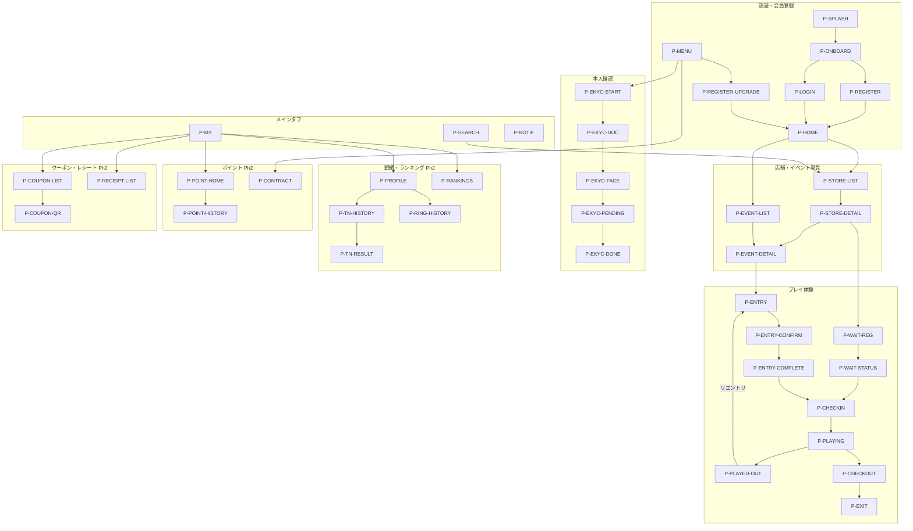

# PGOS Player — モバイルアプリ UX設計

## 対象

- **アプリ**: PGOS Player（iOS / Android ネイティブ + PWA）
- **ユーザー**: ポーカープレイヤー
- **フェーズ**: Phase 1 (MVP) + Phase 2 (拡張)

---

## ナビゲーション構造

### ボトムタブ

```
┌─────────────────────────────────────────┐
│              画面コンテンツ                │
│                                         │
├────────┬────────┬────────┬──────┬────────┤
│  ホーム  │  検索   │  My   │ 通知  │メニュー │
│  (🏠)  │  (🔍)  │  (👤) │ (🔔) │  (≡)  │
└────────┴────────┴────────┴──────┴────────┘
```

| タブ | 画面ID | 内容 | フェーズ |
|------|--------|------|---------|
| ホーム | P-HOME | 近くの店舗、今日のイベント、おすすめ | Ph1 |
| 検索 | P-SEARCH | マップ/リスト切替の店舗・イベント検索 | Ph1 |
| My | P-MY | プロフィール、戦績、ポイント | Ph2（Ph1ではプロフィール簡易版） |
| 通知 | P-NOTIF | プッシュ通知の一覧 | Ph1 |
| メニュー | P-MENU | 設定、eKYC、選手契約、ヘルプ等 | Ph1 |

---

## 画面フロー全体図



---

## Phase 1 画面定義

### P-SPLASH — スプラッシュ画面

| 項目 | 内容 |
|------|------|
| **画面ID** | P-SPLASH |
| **要件ID** | — |
| **目的** | アプリ起動時のブランド表示と認証状態チェック |

```
┌─────────────────────┐
│                     │
│                     │
│                     │
│      PGOS ロゴ       │
│                     │
│     ローディング...    │
│                     │
│                     │
└─────────────────────┘
```

**アクション:**
- 認証済み → P-HOME へ遷移
- 未認証 → P-ONBOARD へ遷移

---

### P-ONBOARD — オンボーディング

| 項目 | 内容 |
|------|------|
| **画面ID** | P-ONBOARD |
| **要件ID** | — |
| **目的** | 初回起動時にサービス概要を伝え、仮会員登録またはログインへ誘導 |

```
┌─────────────────────┐
│                     │
│   [スワイプ式スライド]  │
│                     │
│  1. 店舗を見つけよう   │
│  2. トーナメントに参加  │
│  3. 戦績を記録しよう   │
│                     │
│  ● ○ ○   (ページ)    │
│                     │
│  [今すぐ始める]        │
│  アカウントをお持ちの方 >│
└─────────────────────┘
```

**アクション:**
- 「今すぐ始める」→ P-REGISTER（仮会員登録。ユーザーID + 生年月日のみで会員QRを発行）
- 「アカウントをお持ちの方」→ P-LOGIN

---

### P-LOGIN — ログイン

| 項目 | 内容 |
|------|------|
| **画面ID** | P-LOGIN |
| **要件ID** | C4-1-01, C4-1-02 |
| **目的** | 正式登録済みアカウントでのログイン |

```
┌─────────────────────┐
│  ← 戻る              │
│                     │
│  ログイン             │
│                     │
│  メールアドレス        │
│  ┌─────────────────┐│
│  │                 ││
│  └─────────────────┘│
│  パスワード           │
│  ┌─────────────────┐│
│  │        👁       ││
│  └─────────────────┘│
│                     │
│  [ログイン]           │
│                     │
│  パスワードを忘れた方 > │
│                     │
│  ─── または ───      │
│  [G] Google         │
│  [] Apple          │
│  [L] LINE           │
│  [f] Facebook       │
│  [X] X              │
│  [Y] Yahoo          │
│                     │
└─────────────────────┘
```

**認証方式:**
- **メール + パスワード**: メールアドレスとパスワードによるログイン
- **ソーシャルログイン**: Google / Apple / LINE / Facebook / X / Yahoo
- **生体認証**: 2回目以降のログインでは Face ID / Touch ID での認証に対応（初回ログイン後に設定可能）
- **2FA**: 任意設定（オプトイン）。TOTP アプリまたはSMS
- **パスワードリセット**: メールアドレスにリセットリンクを送信

**ワンタイムURL（マジックリンク）の用途:**
- ワンタイムURLは**正式登録時のメールアドレス認証**に使用する（P-REGISTER-UPGRADE）
- ログイン手段としては使用しない。ログインはパスワード or ソーシャル or 生体認証

**ソーシャルプロバイダの表示:**
- 地域に応じて表示プロバイダを最適化（日本: LINE/Google/Apple/Yahoo 優先、海外: Google/Apple/Facebook 優先）

**状態バリエーション:**
- バリデーションエラー: フィールド下に赤字で表示
- 認証失敗: 画面上部にエラーバナー
- 生体認証有効時: ログイン画面の前に生体認証を表示。失敗/スキップ時にこの画面へ

---

### P-REGISTER — 仮会員登録

| 項目 | 内容 |
|------|------|
| **画面ID** | P-REGISTER |
| **要件ID** | C4-1-01, C4-3-03 |
| **目的** | 最小限の情報で仮会員として登録し、会員QRを即時発行する。導入ハードルを最小化 |

```
┌─────────────────────────┐
│  ← 戻る                  │
├─────────────────────────┤
│                         │
│  はじめよう               │
│                         │
│  ユーザーID（公開）        │
│  ┌───────────────────┐  │
│  │ poker_taro         │  │
│  └───────────────────┘  │
│  ✅ 利用可能              │
│                         │
│  生年月日                 │
│  ┌────┬────┬──────────┐ │
│  │ 年  │ 月  │ 日       │ │
│  └────┴────┴──────────┘ │
│                         │
│  ☑ 利用規約に同意          │
│  ☑ プライバシーポリシー     │
│                         │
│  [会員QRを発行する]        │
│                         │
└─────────────────────────┘
```

**仮会員登録の仕組み:**
- アプリインストール時にデバイスにUUIDを生成・保存（Keychain/Keystore）
- ユーザーIDと生年月日の入力のみで仮会員として登録、会員QRを即時発行
- メールアドレスやソーシャルアカウントは不要（正式登録時に設定）

**ユーザーIDのルール:**
- 英数字 + アンダースコア/ハイフンのみ（例: `poker_taro123`）
- 3〜20文字
- 大文字・小文字を区別しない（`PokerTaro` と `pokertaro` は同一扱い）
- 重複不可（リアルタイムで使用可否をチェック）
- ランキング、プロフィール、チャット等すべてこのIDで統一表示
- 変更可能だが、旧IDは一定期間予約（なりすまし防止）

**生年月日の用途:**
- 年代タグの自動生成（会員QR付近に表示）
- 風営法・青少年育成条例に基づく年齢制限の判定
- 18歳未満のプレイヤーに対するポイント関連機能のブロック

**登録完了画面:**

```
┌─────────────────────────┐
│                         │
│       🎉 ようこそ！       │
│                         │
│  ┌───────────────────┐  │
│  │                   │  │
│  │   ┌─────────┐     │  │
│  │   │ QR CODE │     │  │
│  │   │         │     │  │
│  │   └─────────┘     │  │
│  │                   │  │
│  │   poker_taro      │  │
│  │   [一般]  ← 年代タグ│  │
│  └───────────────────┘  │
│                         │
│  仮会員として登録しました   │
│  このQRで店舗チェックインが │
│  できます                 │
│                         │
│  💡 正式登録すると戦績の    │
│  記録やランキングが         │
│  利用できます              │
│  [あとで正式登録する >]     │
│                         │
│  [はじめる]               │
│                         │
└─────────────────────────┘
```

**アクション:**
- 「はじめる」→ P-HOME
- 「あとで正式登録する」→ P-REGISTER-UPGRADE

**仮会員の制約:**

| 機能 | 仮会員 | 正式会員 |
|------|--------|---------|
| 店舗検索・イベント閲覧 | ○ | ○ |
| 会員QR表示 | ○ | ○ |
| スタッフ操作による当日カウンターエントリー | ○ | ○ |
| セルフレジストレーション（オンライン決済） | ✕ | ○ |
| ウェイティングリスト登録 | ✕ | ○ |
| 戦績の正式記録 | 仮記録（マージ後に正式化） | ○ |
| 経験値（XP）蓄積 | ○（マージ後に引き継ぎ） | ○ |
| ポイント受取・アワーディング | ✕ | ○（eKYC + 選手契約が必要） |
| デバイス変更時のデータ引き継ぎ | ✕ | ○（ログインで復帰） |

---

### P-REGISTER-UPGRADE — 正式登録（正会員への昇格）

| 項目 | 内容 |
|------|------|
| **画面ID** | P-REGISTER-UPGRADE |
| **要件ID** | C4-1-01, C4-1-02, C4-3-03 |
| **目的** | 仮会員から正会員に昇格する。メール認証またはソーシャルアカウント連携と国の入力 |

```
┌─────────────────────────┐
│  ← 戻る                  │
├─────────────────────────┤
│                         │
│  正式登録                 │
│                         │
│  戦績の記録やポイント機能   │
│  を利用するには正式登録が    │
│  必要です                 │
│                         │
│  ── メールで登録 ────────  │
│  メールアドレス            │
│  ┌───────────────────┐  │
│  │                   │  │
│  └───────────────────┘  │
│  パスワード              │
│  ┌───────────────────┐  │
│  │                   │  │
│  └───────────────────┘  │
│  [認証メールを送信]        │
│                         │
│  ─── または ───          │
│  [G] Google で登録        │
│  [] Apple で登録         │
│  [L] LINE で登録          │
│  [f] Facebook で登録      │
│  [X] X で登録             │
│  [Y] Yahoo で登録         │
│                         │
│  ── お住まいの国 ────────  │
│  ┌───────────────────┐  │
│  │ 🇯🇵 日本         ▼  │  │
│  └───────────────────┘  │
│                         │
└─────────────────────────┘
```

**メール認証方式:**
- メールアドレス + パスワードを入力 → ワンタイムURL（認証リンク）をメールに送信 → メール内リンクをタップ → アプリに戻りメールアドレスが認証され、正式登録完了
- ワンタイムURLはメールアドレスの所有確認専用（ログイン手段ではない）
- ディープリンク（iOS Universal Links / Android App Links）で認証完了後にアプリに自動復帰

**正式登録の到達ポイント（登録を促すタイミング）:**
- P-MENU の「正式登録」リンク
- チェックアウト後: 「正式登録すると戦績が記録されます」
- アワーディング対象時: 「ポイントを受け取るには正式登録が必要です」
- 一定回数以上のチェックイン後に案内

**アクション:**
- メール認証完了 or ソーシャル連携完了 → 仮会員データとマージ → P-HOME
- マージ: 仮会員中のプレイ履歴（チェックイン、トーナメント参加等）が正式アカウントに引き継がれる

---

### P-HOME — ホーム

| 項目 | 内容 |
|------|------|
| **画面ID** | P-HOME |
| **要件ID** | A1-1-01, A1-2-01, A1-2-07, A1-2-08, A1-3-01 |
| **目的** | アプリの起点。プレイイン中・レジストレーション済・受付中のトーナメントを優先表示し、リングゲーム・お気に入り店舗を分離表示 |

```
┌─────────────────────┐
│  PGOS    📍東京  🔔2  │
├─────────────────────┤
│                     │
│  こんにちは、○○さん    │
│                     │
│ ┌─ 🎮 プレイ中 ───────┐│
│ │ 🏆 デイリーNLH      ││
│ │ 店舗A  Lv4 残り18人 ││
│ │ T3/S5  ⏱ 1:34      ││
│ └──────────────────┘│
│ ┌─ ✅ チェックイン待ち ─┐│
│ │ 🏆 ナイトPLO  店舗C  ││
│ │ 20:00  登録済み      ││
│ └──────────────────┘│
│                     │
│ ┌─ 🏆 受付中トーナメント ┐│
│ │ デイリーPLO   NEW    ││
│ │ 店舗C  20:00 ¥5,000 ││
│ │ 🔥8/12名 締切 1:24  ││
│ │ サンデー杯           ││
│ │ 店舗B  13:00 ¥8,000 ││
│ │ 4/36名  締切 2日     ││
│ │         すべて見る > ││
│ └──────────────────┘│
│                     │
│ ┌─ 🃏 リングゲーム ───┐│
│ │ [マップサムネイル]    ││
│ │ 店舗A  営業中 0.5km ││
│ │ NLH 1-2  空席3     ││
│ │ 店舗B  営業中 1.2km ││
│ │ NLH 2-5  待ち2人   ││
│ │         すべて見る > ││
│ └──────────────────┘│
│                     │
│ ┌─ お気に入り店舗 ────┐│
│ │ 店舗D  本日休業      ││
│ │ 店舗E  営業中 NEW   ││
│ └──────────────────┘│
│                     │
├────────┬────┬───┬──┬─┤
│ホーム  │検索│My │通知│≡│
└────────┴────┴───┴──┴─┘
```

**セクションの表示順序（優先度順）:**
1. **プレイ中（プレイイン）**: プレイヤーが現在プレイ中のトーナメント。最優先で最上部に固定表示。進行状況（レベル・残り人数・テーブル/シート）をリアルタイム表示
2. **チェックイン待ち（レジストレーション済）**: エントリー登録済みだがまだチェックインしていないトーナメント。開始時刻と会場情報を強調表示。タップでトーナメント詳細へ
3. **受付中トーナメント**: エントリー受付中のトーナメント。エントリー締切までの残り時間をカウントダウン表示。エントリー数/定員を表示（クラブが非公開設定の場合は非表示）。🔥（ホット）バッジは定員の70%以上で表示
4. **リングゲーム**: 近くの店舗で現在オープン中のリングゲームテーブル。空席数・待ち人数のリアルタイム表示。マップサムネイルで位置を把握
5. **お気に入り店舗**: 登録済み店舗の営業ステータス。NEW タグ（開業日から3ヶ月以内）あり

**アクション:**
- プレイ中カード → P-PLAYING
- チェックイン待ちカード → P-EVENT-DETAIL
- トーナメントカード → P-EVENT-DETAIL
- 店舗カード / リングゲームカード → P-STORE-DETAIL
- 「すべて見る」→ P-EVENT-LIST / P-STORE-LIST
- マップサムネイル → P-SEARCH (マップモード)

**状態バリエーション:**
- 位置情報未許可: 位置情報許可を促すバナー表示
- お気に入り未登録: お気に入り登録を促すカード表示
- プレイイン中のトーナメントなし: 「プレイ中」セクション非表示
- チェックイン待ちのトーナメントなし: 「チェックイン待ち」セクション非表示
- 受付中トーナメントなし: 「今後のトーナメント」に切替表示
- シートアウト（バスト・リエントリ可能）: 「プレイ中」セクションに「バスト — リエントリ可能」として表示

---

### P-SEARCH — 検索・マップ

| 項目 | 内容 |
|------|------|
| **画面ID** | P-SEARCH |
| **要件ID** | A1-1-01〜A1-1-09, A1-2-01〜A1-2-11, A1-4-01〜A1-4-06 |
| **目的** | マップまたはリストで店舗・トーナメント・リングゲームを検索。タグで絞り込み |

```
┌─────────────────────────┐
│  🔍 店舗・イベントを検索     │
├─────────────────────────┤
│ [店舗] [トーナメント] [リング]│
├─────────────────────────┤
│ タグ:                     │
│ [エリア▼][NLH][PLO][初心者] │
│ [GTD10万+][NEW][ﾌﾘｰﾛｰﾙ]..│
├─────────────────────────┤
│                           │
│  ┌───────────────────┐  │
│  │                   │  │
│  │    マップ表示       │  │
│  │  📍📍 📍NEW       │  │
│  │     📍🔥          │  │
│  │                   │  │
│  └───────────────────┘  │
│  [マップ] / [リスト] 切替    │
│                           │
│ ── 店舗タブ ──              │
│  店舗A ── 営業中 ──── NEW ─│
│  NLH 1-2, PLO 2-5         │
│  💰 予算: T ¥3K〜  R 1-2〜  │
│  空席: 3 / 待ち: 0          │
│  ──────────────────────── │
│  店舗B ── 営業中 ────       │
│  NLH 1-2                   │
│  💰 予算: T ¥5K〜  R 1-2    │
│  空席: 0 / 待ち: 2          │
│                           │
│ ── トーナメントタブ ──        │
│  🎮 プレイ中                │
│  🏆 デイリーNLH 店舗A        │
│     Lv4  残り18人 T3/S5     │
│  ✅ チェックイン待ち          │
│  🏆 ナイトPLO 店舗C 20:00    │
│  ── 受付中 ──              │
│  🏆 サンデー杯    HIGH VALUE│
│  店舗B 13:00 ¥8K  8/36名    │
│  🔥 締切まで 1:24           │
│  🏆 PLOスペシャル            │
│  店舗C 20:00 ¥5K  3/24名    │
│     締切まで 4:30            │
│  ── 本日開催 ──             │
│  🏆 ナイトNLH  店舗D        │
│     22:00 ¥3K              │
│                           │
│ ── 大会・シリーズ ──         │
│  🏅 JAPAN OPEN 2026         │
│     3/20-3/25 全12イベント   │
│     総GTD ¥5,000,000       │
│                           │
├────────┬────┬───┬──┬──┤
│ホーム  │検索│My │通知│≡ │
└────────┴────┴───┴──┴──┘
```

**3タブ構成:**
1. **店舗**: 店舗一覧（マップ/リスト）。常設店舗とイベント主催者はフィルタで切替可能。NEWタグ（開店3ヶ月以内）、予算表示あり
2. **トーナメント**: トーナメント一覧。表示順は「プレイ中 → チェックイン待ち → 受付中（締切カウントダウン付き）→ 本日開催 → 今後の予定」。ホット🔥・HIGH VALUEバッジあり。ハウストーナメントと大会（シリーズ＞大会＞トーナメント）は区分して表示
3. **リング**: 現在開催中のリングゲームテーブル一覧。空席数・待ち人数のリアルタイム表示

**タグシステム（絞り込み）:**
- 検索バー下にタグチップを横スクロールで配置（Airbnb方式）
- タグカテゴリ:
  - **エリアタグ**: 地域・最寄り駅（住所から自動付与 + ユーザーの位置情報連動）
  - **ジャンルタグ**: `#NLH` `#PLO` `#ミックス` `#ディープスタック` `#ターボ` `#フリーロール`
  - **プライズタグ**: `#GTD10万+` `#GTD50万+` `#賞品あり`
  - **雰囲気タグ**: `#初心者歓迎` `#新規プレイヤーに人気` `#常連が集まる` `#ガチ勢向け`
  - **ステータスタグ**: `#NEW` `#空席あり` `#今日開催` `#受付中`
  - **パーソナルタグ**: `#行ってみたい`（自分が「行ってみたい」登録したクラブで絞り込み）
- タグをタップするとフィルタ適用、再タップで解除。複数タグの組み合わせ（AND）対応
- よく使われるタグ・人気のタグを先頭に表示。過去の検索・チェックイン履歴に基づくパーソナライズ

**プロモーション広告:**
- トーナメントリスト上に、クラブが設定したプロモーション枠を表示。通常のリスト項目よりも表示面積が大きい画像付きカード、背景ハイライト、「PR」ラベル付きで区別。配信先はユーザー属性（エリア・プレイ嗜好等）によりターゲティング

**バッジ・インジケーター:**
- 🔥 **ホット**: エントリー数が定員の70%以上
- **HIGH VALUE**: プライズ ÷ エントリー費のオッズが高い（例: 33.3x 以上）
- **NEW**: 開店3ヶ月以内の新店舗
- **残りわずか**: 定員の90%以上

**アクション:**
- マップピン / 店舗リスト項目 → P-STORE-DETAIL
- トーナメントカード → P-EVENT-DETAIL
- 大会・シリーズ → P-SERIES-DETAIL
- リングゲームカード → P-STORE-DETAIL（テーブル状況タブ）
- フィルタ / タグ変更 → リアルタイムで結果更新

---

### P-STORE-DETAIL — 店舗詳細

| 項目 | 内容 |
|------|------|
| **画面ID** | P-STORE-DETAIL |
| **要件ID** | A1-1-04, A1-1-05, A1-1-07〜A1-1-09, A1-2-04, A1-3-04〜A1-3-06, A1-4-01〜A1-4-05, A2-1-01 |
| **目的** | 店舗の詳細情報、予算目安、タグ、ニュース、レビュー、現在のテーブル状況、今後のイベントを表示 |

```
┌─────────────────────────┐
│  ← 戻る      🏷行ってみたい ♡ 📤│
├─────────────────────────┤
│  [店舗カバー画像]          │
│                         │
│  店舗A            NEW    │
│  ⭐ 4.5  営業中  [店舗]   │
│  📍 東京都渋谷区...        │
│  🕐 14:00-翌2:00         │
│                         │
│  💰 予算めやす            │
│  トーナメント ¥3,000〜¥8,000│
│  リングゲーム  NLH 1-2〜5-10│
│                         │
│  #初心者歓迎 #NLH #PLO    │
│  #新規プレイヤーに人気      │
├─────────────────────────┤
│[テーブル][トーナメント][ニュース][レビュー][情報]│
├─────────────────────────┤
│                         │
│  ── 現在のテーブル ──      │
│  NLH 1-2 (T1)           │
│  着席 8/9  空席1          │
│  [ウェイティング登録]        │
│                         │
│  NLH 2-5 (T2)           │
│  着席 6/9  空席3          │
│  [ウェイティング登録]        │
│                         │
│  PLO 2-5 (T3)           │
│  待ち 3人                 │
│  [ウェイティング登録]        │
│                         │
│  ── トーナメント ──        │
│  🏆 19:00 デイリーNLH     │
│  ¥3,000  8/36名 🔥       │
│  締切まで 1:24            │
│  [エントリー]              │
│                         │
│  🏆 22:00 ナイトPLO       │
│  ¥5,000  2/24名          │
│  締切まで 5:00            │
│  [エントリー]              │
│                         │
└─────────────────────────┘
```

**店舗ヘッダー情報:**
- **クラブ種別バッジ**: [店舗] または [イベント主催者] を表示。クラブ登録時の種別に基づく
- **NEW タグ**: 開店3ヶ月以内の店舗に自動表示
- **予算めやす**: 過去の開催実績から算出したトーナメント参加費帯とリングゲームレート帯を表示。「この店で遊ぶのにいくらくらいかかるか」を来店前に把握可能
- **タグ**: 店舗に付与されたタグを表示（自動付与 + 事業者設定 + システム提案タグ）

**トーナメント表示:**
- 受付中のトーナメントにはエントリー締切カウントダウンを表示
- エントリー数/定員と、🔥（ホット）バッジで人気度を可視化

**タブ「ニュース」:**
- クラブが投稿したニュース記事一覧（新着順）。お知らせ、キャンペーン、スタッフ紹介等
- カテゴリフィルタ（お知らせ / キャンペーン / コラム等）
- 記事タップで詳細表示（リッチテキスト + 画像）

**タブ「レビュー」:**
- プレイヤーが投稿したレビュー一覧（評価 + テキスト）
- クラブからの返信コメントをレビューの下に表示
- 自分もレビューを投稿可能

**アクション:**
- 🏷行ってみたい → 「行ってみたい」登録/解除。トーナメントリストの絞り込みフィルタに活用
- ♡ → お気に入り登録/解除。初回登録時にSNSフォローポップアップを表示（クラブ設定による）
- 📤 → 共有（SNS / メッセージ）
- 「ウェイティング登録」→ P-WAIT-REG
- 「エントリー」→ P-ENTRY
- トーナメントカード → P-EVENT-DETAIL
- タブ「情報」→ 住所・アクセス・設備・SNS等の静的情報
- タグをタップ → P-SEARCH（当該タグで絞り込み）

**お気に入り登録時ポップアップ（SNSフォロー導線）:**

```
┌─────────────────────────┐
│                         │
│  店舗Aをお気に入りに       │
│  登録しました！            │
│                         │
│  公式SNSもフォローしよう   │
│                         │
│  [L] LINE公式アカウント    │
│  [X] X (@store_a)        │
│  [📷] Instagram           │
│                         │
│  [閉じる]                 │
│                         │
└─────────────────────────┘
```

---

### P-EVENT-DETAIL — イベント/トーナメント詳細

| 項目 | 内容 |
|------|------|
| **画面ID** | P-EVENT-DETAIL |
| **要件ID** | A1-2-03, A2-3-01〜A2-3-05 |
| **目的** | トーナメント/イベントの詳細（ストラクチャー、参加情報）を表示 |

```
┌─────────────────────┐
│  ← 戻る         📤  │
├─────────────────────┤
│  🏆 デイリーNLH       │
│  店舗A               │
│  3/14(土) 19:00      │
├─────────────────────┤
│  エントリー  ¥3,000   │
│  リバイ     ¥2,000   │
│  参加者     12 / 36名 │
│  ギャランティ ¥50,000  │
│                     │
│  [エントリーする]       │
│                     │
├─────────────────────┤
│ [ストラクチャー] [ペイアウト] [参加者] │
├─────────────────────┤
│                     │
│  Lv1  100/200   20分 │
│  Lv2  200/400   20分 │
│  -- Break --    10分 │
│  Lv3  300/600   20分 │
│  Lv4  400/800   15分 │
│  Lv5  500/1000  15分 │
│  -- Break --    10分 │
│  ...                │
│                     │
└─────────────────────┘
```

**タブ「ペイアウト」:**
- 入賞枠と配分表（ポイント表示含む）

**タブ「参加者」:**
- エントリー済みプレイヤー一覧（プロフィールリンク付き）

**アクション:**
- 「エントリーする」→ P-ENTRY（セルフレジストレーション）
- カレンダー登録ボタン → iCal / Google Calendar 連携

**状態バリエーション:**
- **セルフレジストレーション可能**: クラブがセルフレジストレーションを許可したトーナメントの場合のみ「エントリーする」ボタンを表示
- **セルフレジストレーション不可**: 「当日会場にてエントリー」と案内テキストを表示（ボタンは非活性またはなし）
- **登録済み**: 「エントリーする」ボタンの代わりに登録状態カードを表示（QRコード表示ボタン・キャンセルボタン付き）。アドオンが可能な場合は「アドオンを追加」ボタンも表示
- **定員到達**: 「定員に達しました」表示。キャンセル待ち登録が可能な場合はその導線を表示
- **エントリー締切済み**: 「エントリーは締め切りました」表示
- **バケーション通知受信後**: 「テーブル T3 / シート 5 にチップが置かれました」バナー表示

---

### P-WAIT-REG — ウェイティングリスト登録

| 項目 | 内容 |
|------|------|
| **画面ID** | P-WAIT-REG |
| **要件ID** | A2-1-01, A2-1-04 |
| **目的** | リングゲームテーブルのウェイティングリストに登録 |

```
┌─────────────────────┐
│  ウェイティング登録     │
│                ✕ 閉じる│
├─────────────────────┤
│                     │
│  店舗A               │
│                     │
│  テーブルを選択:       │
│  ☑ NLH 1-2 (待ち3人) │
│  ☐ NLH 2-5 (待ち0人) │
│  ☐ PLO 2-5 (待ち1人) │
│                     │
│  ※複数テーブルを       │
│   同時に選択できます    │
│                     │
│  [ウェイティング登録]    │
│                     │
└─────────────────────┘
```

**アクション:**
- 登録成功 → P-WAIT-STATUS に遷移
- 登録済みの場合 → 「すでに登録済みです」表示

---

### P-WAIT-STATUS — ウェイティング状況

| 項目 | 内容 |
|------|------|
| **画面ID** | P-WAIT-STATUS |
| **要件ID** | A2-1-02, A2-1-03, A2-1-05 |
| **目的** | ウェイティングリストの現在位置と推定待ち時間を表示 |

```
┌─────────────────────┐
│  ← 戻る              │
├─────────────────────┤
│                     │
│  ウェイティング中       │
│                     │
│  店舗A               │
│  NLH 1-2             │
│                     │
│  あなたの順番          │
│                     │
│      ┌───┐          │
│      │ 2 │ 番目      │
│      └───┘          │
│                     │
│  推定待ち時間: 約15分   │
│                     │
│  ────────────────   │
│  NLH 2-5             │
│  空席があります！       │
│  [今すぐ着席]          │
│                     │
│  ────────────────   │
│                     │
│  [キャンセルする]       │
│                     │
└─────────────────────┘
```

**リアルタイム更新:**
- 順番が変わるたびに自動更新
- あと1人 → プッシュ通知 + 画面ハイライト

**アクション:**
- 「今すぐ着席」→ P-CHECKIN
- 「キャンセル」→ 確認ダイアログ → P-STORE-DETAIL に戻る

---

### P-CHECKIN — セルフチェックイン（トーナメント）

| 項目 | 内容 |
|------|------|
| **画面ID** | P-CHECKIN |
| **要件ID** | A2-2-01, A2-3-01 |
| **目的** | レジストレーション済みプレイヤーが、QRスキャンでトーナメントにプレイイン（チェックイン）する。支払い済みのためスタッフ介在なしでプレイイン可能 |

```
┌─────────────────────────┐
│  チェックイン        ✕ 閉じる│
├─────────────────────────┤
│                         │
│  QRコードを読み取って     │
│  チェックインしてください  │
│                         │
│  ┌───────────────────┐  │
│  │                   │  │
│  │  [カメラ プレビュー]  │  │
│  │                   │  │
│  │    ┌─────────┐    │  │
│  │    │  読取枠  │    │  │
│  │    └─────────┘    │  │
│  │                   │  │
│  └───────────────────┘  │
│                         │
│  🏆 デイリーNLH          │
│  店舗A  3/14(土) 19:00   │
│  ステータス: レジストレーション済│
│                         │
└─────────────────────────┘
```

**チェックインと配席の関係:**

セルフチェックインと配席は**別の関心事**であり、クラブはそれぞれ独立してシステム利用の有無を選択できる。

| チェックイン方式 | 配席方式 | 説明 |
|---------------|---------|------|
| チェックインQR | 自動配席（システム） | QRスキャン → システムが席を割り当て → テーブル・シート番号を表示 |
| チェックインQR | 配席伝達（非システム） | QRスキャン → チェックイン完了 → 配席はスタッフが口頭 or シートカードで伝達 |
| シートQR | シートに配席（システム） | テーブルのシートQRをスキャン → そのシートに登録 |

- チェックインまでをシステムで行い、配席からはシステムを使わない運用も可能
- 支払い済みプレイヤーはチェックインQRのスキャンだけでプレイイン手続きが完了する
- QR種類の違いはプレイヤーが意識する必要はない（スキャン操作は同じ）
- スタッフ側操作: エントリーとチェックインを同時に処理可能（セルフレジ未利用プレイヤー向け、PGOS Floor / Manager で操作）
- ブレイク時の一斉シート登録: アナログ運用中の場合、ブレイク中に全プレイヤーが座席QRをスキャンしてシステムに移行可能

**チェックイン成功画面（配席あり — システム配席の場合）:**

```
┌─────────────────────────┐
│                   ✕ 閉じる│
├─────────────────────────┤
│                         │
│         ✅ チェックイン完了 │
│                         │
│  🏆 デイリーNLH          │
│  店舗A  3/14(土) 19:00   │
│                         │
│  ┌───────────────────┐  │
│  │  テーブル  3        │  │
│  │  シート    5        │  │
│  │  チップ    20,000   │  │
│  └───────────────────┘  │
│                         │
│  Good luck! 🃏           │
│                         │
└─────────────────────────┘
```

**チェックイン成功画面（配席なし — 非システム配席の場合）:**

```
┌─────────────────────────┐
│                   ✕ 閉じる│
├─────────────────────────┤
│                         │
│         ✅ チェックイン完了 │
│                         │
│  🏆 デイリーNLH          │
│  店舗A  3/14(土) 19:00   │
│                         │
│  チップ    20,000        │
│                         │
│  スタッフの案内に従い      │
│  お席にお着きください       │
│                         │
│  Good luck! 🃏           │
│                         │
└─────────────────────────┘
```

**テーブル到着後のシートQRスキャン（席登録）:**

配席通知（システム配席）または口頭/シートカード（非システム配席）で席に着いた後、テーブルのシートQRをスキャンすると「席登録」が行われる。これは任意のステップであり、非システム配席の場合でもあとからシステムに席情報を登録できる合流ポイントとなる。

```
┌─────────────────────────┐
│                   ✕ 閉じる│
├─────────────────────────┤
│                         │
│         ✅ 席登録完了      │
│                         │
│  テーブル 3 / シート 5    │
│  に登録しました            │
│                         │
└─────────────────────────┘
```

**スタッフ確認画面（クラブのオプション設定）:**

クラブが有効にした場合、チェックインまたは席登録の後にプレイヤー端末上にスタッフ確認画面が表示される。スタッフがプレイヤーの端末を見てスワイプ操作する。チップの手渡しと本人確認を兼ねる。

```
┌─────────────────────────┐
│  スタッフ確認              │
├─────────────────────────┤
│                         │
│  ⚠ スタッフに画面を       │
│    見せてください          │
│                         │
│  ┌───────────────────┐  │
│  │  [プレイヤー顔写真]   │  │
│  │                   │  │
│  │  プレイヤー名        │  │
│  │  チップ: 20,000     │  │
│  │  テーブル: 3        │  │
│  │  シート: 5          │  │
│  └───────────────────┘  │
│                         │
│  ╔═══════════════════╗  │
│  ║ ≫≫ スワイプして確認  ║  │
│  ╚═══════════════════╝  │
│                         │
└─────────────────────────┘
```

- スタッフがスワイプ → 確認完了
- チップの二重渡し防止: 一度確認されたらこの画面は再表示されない

**制約:**
- チェックイン後のキャンセルは不可（チェックイン前のレジストレーションキャンセルは P-ENTRY-COMPLETE から可能）

**アクション:**
- チェックインQRスキャン → チェックイン成功画面（配席あり/なし）→ P-PLAYING
- シートQRスキャン → 席登録完了画面 → P-PLAYING
- いずれの場合もスタッフ確認画面を経由する場合あり（クラブ設定）
- P-ENTRY-COMPLETE の「チェックインへ進む」からも到達可能
- 非システム配席で運営しているクラブでも、あとからシートQRスキャンでシステムに合流可能

---

### P-ENTRY — セルフレジストレーション（登録内容選択）

| 項目 | 内容 |
|------|------|
| **画面ID** | P-ENTRY |
| **要件ID** | A2-3-01, A2-3-02, A4-1-03 |
| **目的** | セルフレジストレーションの登録内容と支払い方法を選択する |

```
┌─────────────────────────┐
│  セルフレジストレーション  ✕│
├─────────────────────────┤
│                         │
│  🏆 デイリーNLH          │
│  店舗A  3/14(土) 19:00   │
│                         │
│  ── 登録内容を選択 ─────  │
│                         │
│  ☑ エントリー   ¥3,000   │
│    スタートチップ 20,000  │
│                         │
│  ☐ アドオン      ¥2,000  │
│    +10,000チップ         │
│                         │
│  ────────────────────   │
│  小計          ¥3,000    │
│                         │
│  ── お支払い方法 ────────  │
│                         │
│  ○ オンライン決済（前払い） │
│    💳 VISA **** 1234     │
│    [カードを変更 >]       │
│                         │
│  ○ 前払い（当日店頭払い）  │
│                         │
│  ○ 後払い（退店時一括）    │
│                         │
│  ────────────────────   │
│                         │
│  [次へ進む]               │
│                         │
└─────────────────────────┘
```

**前提条件:**
- この画面はクラブがセルフレジストレーションを許可したトーナメントでのみ到達可能

**登録内容の表示ルール:**
- クラブが設定した購入可能アイテム（エントリー、アドオン、リエントリー等）のみ表示
- 各アイテムにチップ数・価格を明示
- 組み合わせ不可のアイテム（例: エントリーとリエントリーの同時選択）はUI上で排他制御

**支払い方法:**
- **オンライン決済（前払い）**: クレジットカード等によるオンライン決済。登録済みカードがあれば表示、なければカード追加フローへ誘導。決済金はクラブの銀行口座に直接入金（Stripe Connect等）。正式会員のみ利用可能
- **前払い（当日店頭払い）**: 当日会場の受付にて、チェックイン前に現金等で先払い。レジストレーション + 決済完了状態
- **後払い（退店時一括）**: プレイ後にまとめて退店時に支払い。レジストレーション自体は確定するが決済は未完了状態。退店時精算（P-EXIT）への導線あり

**アクション:**
- 「次へ進む」→ P-ENTRY-CONFIRM（確認・決済画面へ）
- 登録内容未選択時は「次へ進む」を非活性

**状態バリエーション:**
- **アドオン追加時**（登録済みプレイヤーがアドオンを追加購入）: エントリーは選択済み・変更不可として表示し、アドオンのみ選択可能
- **eKYC未完了 + ポイント利用**: 「本人確認が必要です」→ eKYCフローへ誘導

---

### P-ENTRY-CONFIRM — セルフレジストレーション（確認・決済）

| 項目 | 内容 |
|------|------|
| **画面ID** | P-ENTRY-CONFIRM |
| **要件ID** | A2-3-01, A2-3-02 |
| **目的** | 登録内容を最終確認し、オンライン決済の場合はクラブの注意事項に同意の上で決済を実行する |

**オンライン決済の場合:**

```
┌─────────────────────────┐
│  ← 確認・決済             │
├─────────────────────────┤
│                         │
│  🏆 デイリーNLH          │
│  店舗A  3/14(土) 19:00   │
│                         │
│  ── ご注文内容 ─────────  │
│  エントリー      ¥3,000  │
│  ────────────────────   │
│  合計           ¥3,000   │
│  決済方法  VISA **** 1234│
│                         │
│  ── ご注意事項 ─────────  │
│  ┌───────────────────┐  │
│  │ (クラブが設定した      │  │
│  │  注意事項テキスト)     │  │
│  │                   │  │
│  │ ・キャンセルポリシー:  │  │
│  │  開始1時間前まで      │  │
│  │  キャンセル可能。     │  │
│  │  決済済みの場合は     │  │
│  │  ポイントにて返還     │  │
│  │ ・遅刻の場合:        │  │
│  │  クラブの設定に      │  │
│  │  従います           │  │
│  └───────────────────┘  │
│                         │
│  ☐ 上記注意事項に同意します │
│                         │
│  ╔═══════════════════╗  │
│  ║ ≫≫ スライドして決済  ║  │
│  ╚═══════════════════╝  │
│                         │
└─────────────────────────┘
```

**前払い（当日店頭払い）の場合:**

```
┌─────────────────────────┐
│  ← 確認                  │
├─────────────────────────┤
│                         │
│  🏆 デイリーNLH          │
│  店舗A  3/14(土) 19:00   │
│                         │
│  ── ご注文内容 ─────────  │
│  エントリー      ¥3,000  │
│  ────────────────────   │
│  合計           ¥3,000   │
│  お支払い   当日店頭前払い  │
│                         │
│  💡 チェックイン前に        │
│     受付にてお支払いください  │
│                         │
│  [登録を確定する]          │
│                         │
└─────────────────────────┘
```

**後払い（当日店頭払い）の場合:**

```
┌─────────────────────────┐
│  ← 確認                  │
├─────────────────────────┤
│                         │
│  🏆 デイリーNLH          │
│  店舗A  3/14(土) 19:00   │
│                         │
│  ── ご注文内容 ─────────  │
│  エントリー      ¥3,000  │
│  ────────────────────   │
│  合計           ¥3,000   │
│  お支払い   退店時一括払い  │
│                         │
│  💡 退店時にまとめて        │
│     お支払いいただきます     │
│                         │
│  [登録を確定する]          │
│                         │
└─────────────────────────┘
```

**スライドスイッチの仕様:**
- 誤操作防止のため、決済はタップボタンではなくスライド操作で確定する
- 注意事項への同意チェックがオフの間はスライド不可（グレーアウト）
- スライド完了後はローディング表示、二重決済を防止するためUI全体を操作不可にする

**エラー時:**
- 決済失敗: 画面上部にエラーバナー表示。リトライまたはカード変更を促す
- 通信エラー: リトライボタン付きのエラー表示
- タイムアウト: 決済状態を確認中のローディング → 結果表示

**アクション:**
- スライド完了（オンライン決済）→ 決済処理 → P-ENTRY-COMPLETE
- 「登録を確定する」（後払い）→ P-ENTRY-COMPLETE
- 「←」→ P-ENTRY に戻る

---

### P-ENTRY-COMPLETE — セルフレジストレーション完了

| 項目 | 内容 |
|------|------|
| **画面ID** | P-ENTRY-COMPLETE |
| **要件ID** | A2-3-01, A2-3-05 |
| **目的** | レジストレーション完了を表示し、当日のチェックインに使うQRコードとクラブからのメッセージを提示する |

```
┌─────────────────────────┐
│                   ✕ 閉じる│
├─────────────────────────┤
│                         │
│         ✅ 完了           │
│  レジストレーション完了     │
│                         │
│  🏆 デイリーNLH          │
│  店舗A  3/14(土) 19:00   │
│                         │
│  ┌───────────────────┐  │
│  │                   │  │
│  │    ┌─────────┐    │  │
│  │    │ QR CODE │    │  │
│  │    │         │    │  │
│  │    └─────────┘    │  │
│  │                   │  │
│  └───────────────────┘  │
│                         │
│  スタートチップ   20,000   │
│  年齢区分       一般      │
│  お支払い   オンライン決済済│
│                         │
│  ── クラブからのメッセージ ─│
│  ┌───────────────────┐  │
│  │ 「受付は18:30から    │  │
│  │  開始します。        │  │
│  │  遅れないよう        │  │
│  │  お越しください。」   │  │
│  └───────────────────┘  │
│                         │
│  [チェックインへ進む]       │
│                         │
│  ────────────────────   │
│  📄 レシートを表示 >       │
│  [登録をキャンセル]        │
│                         │
└─────────────────────────┘
```

**QRコードの用途:**
- 当日会場でチェックインQRまたはシートQRを読み取ってセルフチェックイン（P-CHECKIN）する際の本人特定に使用
- P-EVENT-DETAIL の登録済み状態からも再表示可能

**表示項目:**
- トーナメント名・会場・日時
- QRコード（チェックイン用）
- スタートチップ数
- 年齢区分（一般 / ジュニア等、クラブ設定に基づく）
- お支払いステータス（オンライン決済済 / 当日店頭払い）
- クラブが設定したメッセージ（会場案内、注意事項等）

**レシート/領収書:**
- 「レシートを表示」→ 決済内容の詳細画面を表示
- アプリ内で閲覧可能。ダウンロード（PDF）またはメール送信に対応
- 領収書はクラブが発行する（当社からは領収書を発行しない）

**アクション:**
- 「チェックインへ進む」→ P-CHECKIN（QRスキャン画面）。会場にいる場合はそのままチェックインに進める
- 「✕ 閉じる」→ P-EVENT-DETAIL（登録済み状態）に戻る
- 「登録をキャンセル」→ キャンセル確認ダイアログ

**キャンセルポリシー:**
- **プレイヤーからのキャンセルはチェックイン前に限る。** チェックイン後はプレイヤー側からキャンセルできない（店舗側のみ操作可能）
- オンライン決済済みの場合の返金処理は以下の優先順で実行:
  1. **決済取消し（消し込み）**: 決済代行の取消し可能期間内であれば、決済自体を取り消す（プレイヤーへの請求が発生しない）
  2. **返金ポイント付与**: 決済取消しが不可能な場合（期間超過等）、相当額のポイント（前払い式立替手段）を付与

**キャンセル確認ダイアログ（オンライン決済済みの場合）:**

```
┌───────────────────────┐
│                       │
│  登録をキャンセル        │
│  しますか？             │
│                       │
│  お支払い済みの金額は     │
│  決済取消しまたは        │
│  ポイントにて返還        │
│  されます。             │
│                       │
│  [キャンセルする]  [戻る] │
│                       │
└───────────────────────┘
```

**キャンセル確認ダイアログ（前払い・後払いの場合）:**

```
┌───────────────────────┐
│                       │
│  登録をキャンセル        │
│  しますか？             │
│                       │
│  [キャンセルする]  [戻る] │
│                       │
└───────────────────────┘
```

- キャンセル完了後 → P-EVENT-DETAIL（未登録状態）に戻る

**エントリー締切時の未チェックイン処理（プレイヤー側の見え方）:**

クラブがトーナメントごとに事前設定した処理方式に従い、エントリー締切時にチェックインしていないプレイヤーには以下のいずれかが適用される:

| 方式 | プレイヤーへの通知 | 処理内容 |
|------|-----------------|---------|
| キャンセル | 「エントリーがキャンセルされました」プッシュ通知 | 登録取消。決済済みの場合は決済取消し → 不可なら返金ポイント付与 |
| バケーション | 「テーブル T3 / シート 5 にチップが置かれました」プッシュ通知 | スタッフが代理でチップを配置。テーブル番号・シート番号を通知 |

---

### P-PLAYING — プレイ中（トーナメント）

| 項目 | 内容 |
|------|------|
| **画面ID** | P-PLAYING |
| **要件ID** | A2-2-02, A2-3-03, A2-3-04 |
| **目的** | トーナメントプレイ中の状況表示。リエントリ/アドオンの操作起点 |

```
┌─────────────────────────┐
│  プレイ中  店舗A          │
├─────────────────────────┤
│                         │
│  🏆 デイリーNLH          │
│  テーブル 3 / シート 5    │
│                         │
│  ── トーナメント進行 ────  │
│  レベル: Lv4  400/800    │
│  Ante: 100              │
│  残り: 18名 / 24名       │
│  平均スタック: 25,000     │
│  次のブレイク: 12分後      │
│                         │
│  ⏱ プレイ時間 1:34:15    │
│                         │
│  ── アクション ─────────  │
│  [🔄 リエントリ / アドオン] │
│  [🍔 飲食オーダー]        │
│  [💬 スタッフを呼ぶ]      │
│                         │
│  ────────────────────   │
│  [チェックアウト]          │
│                         │
├────────┬────┬───┬───┬────┤
│ホーム  │検索│My │通知│≡  │
└────────┴────┴───┴───┴────┘
```

**リアルタイム更新:**
- トーナメント進行情報は WebSocket でリアルタイム反映
- プレイ時間は秒単位でカウントアップ
- シート移動があった場合、テーブル/シート番号がリアルタイム更新される

**チップ数入力（任意）:**
- プレイヤーが自分のスタック数を手入力で記録できる機能（P-PLAYING画面内にインライン入力）
- 正確性は保証されないが、プレイヤー自身の記録ツールとして活用
- 入力されたスタック推移は P-TN-RESULT（戦績詳細）に反映

**リエントリ/アドオン:**
- 「リエントリ / アドオン」→ P-ENTRY（リエントリ/アドオンモード）に遷移
- クラブの設定でリエントリ/アドオンが許可されている期間のみ表示
- レジストレーション締切後は非表示

**飲食モバイルオーダー:**
- 「飲食オーダー」→ 飲食メニュー一覧 → 注文確定。席情報（テーブル/シート）が自動で送信され、配膳先が明確になる
- 後払い（退店時一括）の場合、飲食代も退店精算に合算される

**チェックアウト:**
- レジストレーション締切前: 「チェックアウト」→ P-PLAYED-OUT（プレイアウト状態。リエントリ可能）
- レジストレーション締切後: 「チェックアウト」→ P-CHECKOUT（順位確定へ）

**シート移動通知:**

トーナメント中にシート移動（テーブルバランスやテーブルブレイク）が発生した場合:

```
┌─────────────────────────┐
│                         │
│  🔔 シート移動           │
│                         │
│  新しい席に移動して       │
│  ください                │
│                         │
│  ┌───────────────────┐  │
│  │  テーブル  5        │  │
│  │  シート    2        │  │
│  └───────────────────┘  │
│                         │
│  [OK]                   │
│                         │
└─────────────────────────┘
```

- プッシュ通知 + アプリ内モーダルで通知
- 「OK」タップ後、P-PLAYING のテーブル/シート番号が更新される

---

### P-PLAYED-OUT — プレイアウト（レジストレーション締切前）

| 項目 | 内容 |
|------|------|
| **画面ID** | P-PLAYED-OUT |
| **要件ID** | A2-3-03 |
| **目的** | レジストレーション締切前にバストしたプレイヤーに、リエントリの案内を行う |

```
┌─────────────────────────┐
│  プレイアウト              │
├─────────────────────────┤
│                         │
│  🏆 デイリーNLH          │
│  店舗A  3/14(土) 19:00   │
│                         │
│  ──────────────────     │
│  プレイアウトしました       │
│  ──────────────────     │
│                         │
│  リエントリ受付中！        │
│  締切まで残り 45分        │
│                         │
│  エントリー費  ¥3,000     │
│  スタートチップ 20,000    │
│                         │
│  [リエントリする]          │
│                         │
│  ────────────────────   │
│  📊 現在のトーナメント状況  │
│  残りプレイヤー: 16名     │
│  平均スタック: 28,000     │
│  レベル: Lv5 500/1000    │
│                         │
│  [トーナメント詳細を見る]   │
│  [ホームに戻る]           │
│                         │
├────────┬────┬───┬───┬────┤
│ホーム  │検索│My │通知│≡  │
└────────┴────┴───┴───┴────┘
```

**状態の意味:**
- レジストレーション締切前のバスト = 「プレイアウト」状態
- プレイアウトでは順位は付かない（リエントリの可能性があるため）
- リエントリしない場合、レジストレーション締切時に同一順位としてまとめて処理される

**順位の考え方:**
- 順位はエントリー単位ではなく**ユニークプレイヤー単位**で付与
- 例: 1回目エントリーでバスト（プレイアウト）→ リエントリ → 2回目バスト（チェックアウト）の場合、2回目の順位のみが有効

**リエントリ促進通知（プッシュ通知）:**
- プレイアウト時に「リエントリ可能です（残りN分）」のプッシュ通知を送信
- プレイヤーは通知設定でこの通知をオフにできる

**アクション:**
- 「リエントリする」→ P-ENTRY（リエントリモード）
- 「トーナメント詳細を見る」→ P-EVENT-DETAIL
- 「ホームに戻る」→ P-HOME

---

### P-CHECKOUT — セルフチェックアウト（トーナメント）

| 項目 | 内容 |
|------|------|
| **画面ID** | P-CHECKOUT |
| **要件ID** | A2-2-02 |
| **目的** | レジストレーション締切後のバスト（チェックアウト）を確定する。通常はスタッフが処理するが、プレイヤー自身でも操作可能 |

**P-PLAYING からの遷移（アプリ内操作の場合）:**

```
┌─────────────────────────┐
│  チェックアウト             │
├─────────────────────────┤
│                         │
│  🏆 デイリーNLH          │
│  店舗A  3/14(土) 19:00   │
│                         │
│  チェックアウト（プレイアウト）│
│  しますか？               │
│                         │
│  ⚠ チェックアウト後は      │
│    取り消しできません       │
│                         │
│  ╔═══════════════════╗  │
│  ║ ≫≫ スワイプして確定  ║  │
│  ╚═══════════════════╝  │
│                         │
│  [キャンセル]              │
│                         │
└─────────────────────────┘
```

**チェックアウト方法:**

| 方法 | 操作 | 備考 |
|------|------|------|
| アプリ内ボタン | P-PLAYING の「チェックアウト」→ スワイプ確認 | 誤操作防止 |
| チェックイン/アウト用QRスキャン | QRをスキャン → チェックアウト確定 | スタッフ不要 |
| スタッフ操作 | Manager側でスタッフがチェックアウト処理 | 通常はこちらが一般的 |

**チェックアウト完了画面:**

```
┌─────────────────────────┐
│                   ✕ 閉じる│
├─────────────────────────┤
│                         │
│  チェックアウト完了        │
│                         │
│  🏆 デイリーNLH          │
│  お疲れ様でした            │
│                         │
│  プレイ時間: 2時間34分     │
│                         │
│  順位は結果確定後に        │
│  通知されます              │
│                         │
│  [ホームに戻る]           │
│                         │
└─────────────────────────┘
```

**チェックアウト完了画面（後払い — 退店時一括の場合）:**

```
┌─────────────────────────┐
│                   ✕ 閉じる│
├─────────────────────────┤
│                         │
│  チェックアウト完了        │
│                         │
│  🏆 デイリーNLH          │
│  お疲れ様でした            │
│                         │
│  プレイ時間: 2時間34分     │
│                         │
│  ── 本日の未精算 ────────  │
│  エントリー      ¥3,000  │
│  アドオン        ¥2,000  │
│  ────────────────────   │
│  合計           ¥5,000   │
│                         │
│  💡 退店時にお支払い       │
│     ください              │
│                         │
│  [退店精算へ進む]          │
│  [ホームに戻る]           │
│                         │
└─────────────────────────┘
```

**チェックアウト後:**
- 順位はトーナメント終了後に確定（アワーディング時にスタッフが確認・反映）
- 順位確定後にプッシュ通知 + P-TN-RESULT に反映
- 後払い（退店時一括）の場合は、未精算額を表示し退店精算への導線を提示

---

### P-EXIT — 退店精算

| 項目 | 内容 |
|------|------|
| **画面ID** | P-EXIT |
| **要件ID** | B4-1-01, B4-1-03 |
| **目的** | 後払い（退店時一括）利用時の退店前精算。本日の未精算額をまとめてオンラインまたは店頭で支払う |

```
┌─────────────────────────┐
│  退店精算                  │
├─────────────────────────┤
│                         │
│  本日の利用明細            │
│                         │
│  🏆 デイリーNLH          │
│  エントリー      ¥3,000  │
│  アドオン        ¥2,000  │
│                         │
│  🍔 飲食                 │
│  ドリンク 2点    ¥1,000  │
│                         │
│  ────────────────────   │
│  合計           ¥6,000   │
│                         │
│  ── お支払い方法 ────────  │
│                         │
│  ○ オンライン決済         │
│    💳 VISA **** 1234     │
│                         │
│  ○ 店頭で支払う           │
│    （スタッフにお声がけください）│
│                         │
│  ╔═══════════════════╗  │
│  ║ ≫≫ スライドして精算  ║  │
│  ╚═══════════════════╝  │
│                         │
└─────────────────────────┘
```

**退店精算完了:**

```
┌─────────────────────────┐
│                   ✕ 閉じる│
├─────────────────────────┤
│                         │
│       ✅ 精算完了          │
│                         │
│  合計           ¥6,000   │
│  決済方法  VISA **** 1234│
│                         │
│  📄 レシートを表示 >       │
│                         │
│  ── 本日のサマリー ──────  │
│  プレイ時間: 2時間34分     │
│  獲得経験値: +120 XP     │
│                         │
│  🔍 次のトーナメントを探す > │
│                         │
│  [ホームに戻る]           │
│                         │
└─────────────────────────┘
```

**後払い（退店時一括）の制約:**
- B5-3-03（後払い10万円超過の警告）に基づき、未精算合計が税別10万円を超える場合はシステムが警告を表示
- 飲食オーダーなどトーナメント外の利用も合算可能（クラブ設定による）
- 退店精算せずに退店した場合: スタッフがManager側で精算処理。次回来店時に未精算がある場合は通知

---

### P-EKYC-START — eKYC 開始

| 項目 | 内容 |
|------|------|
| **画面ID** | P-EKYC-START |
| **要件ID** | A6-1-01〜A6-1-05 |
| **目的** | 本人確認手続きの開始案内。認証方式を選択する |

```
┌─────────────────────────┐
│  ← 戻る                  │
├─────────────────────────┤
│                         │
│  本人確認 (eKYC)          │
│                         │
│  ポイントの利用や          │
│  トランスファーには         │
│  本人確認が必要です         │
│                         │
│  ── 認証方式を選択 ──────  │
│                         │
│  ┌───────────────────┐  │
│  │ 📸 撮影で認証         │  │
│  │ 書類を撮影 + 顔撮影    │  │
│  │ 所要時間: 約3分       │  │
│  │ [この方式で始める >]   │  │
│  └───────────────────┘  │
│                         │
│  ┌───────────────────┐  │
│  │ 📱 ICチップで認証      │  │
│  │ NFC対応書類をかざす    │  │
│  │ 所要時間: 約1分       │  │
│  │ [この方式で始める >]   │  │
│  └───────────────────┘  │
│                         │
│  📄 対応書類:             │
│  ・パスポート（撮影/IC）    │
│  ・運転免許証（撮影/IC）    │
│  ・マイナンバーカード（IC）  │
│  ・在留カード（撮影/IC）    │
│                         │
│  📋 審査: 原則1営業日      │
│                         │
└─────────────────────────┘
```

**認証方式:**
- **撮影認証（従来方式）**: P-EKYC-DOC（書類撮影）→ P-EKYC-FACE（顔撮影）→ P-EKYC-PENDING → P-EKYC-DONE
- **IC認証（NFC方式）**: P-EKYC-IC（NFC読取）→ P-EKYC-FACE（顔撮影）→ P-EKYC-PENDING → P-EKYC-DONE
  - IC認証では、書類のICチップから情報を読み取るため、撮影工程が不要でUXが向上
  - NFC対応デバイスでのみ表示。非対応デバイスでは撮影認証のみ表示
- **パスポートOCR**: 撮影認証時、パスポートのMRZ（機械読取領域）をOCRで読み取り、氏名・国籍・生年月日等を自動入力（手入力の手間を削減）

---

### P-NOTIF — 通知一覧

| 項目 | 内容 |
|------|------|
| **画面ID** | P-NOTIF |
| **要件ID** | A1-3-01, A1-3-02 |
| **目的** | プッシュ通知の履歴を一覧表示 |

```
┌─────────────────────┐
│  通知                │
├─────────────────────┤
│                     │
│  今日               │
│  ┌─────────────────┐│
│  │🔔 順番が来ました   ││
│  │ 店舗A NLH 1-2    ││
│  │ 5分前            ││
│  ├─────────────────┤│
│  │🏆 まもなく開始     ││
│  │ デイリーNLH 30分後 ││
│  │ 1時間前           ││
│  └─────────────────┘│
│                     │
│  昨日               │
│  ┌─────────────────┐│
│  │📢 新イベント追加    ││
│  │ 店舗B 週末トーナメ.. ││
│  │ 昨日 18:00        ││
│  └─────────────────┘│
│                     │
├────────┬────┬───┬──┬─┤
│ホーム  │検索│My │通知│≡│
└────────┴────┴───┴──┴─┘
```

---

### P-MENU — メニュー/設定

| 項目 | 内容 |
|------|------|
| **画面ID** | P-MENU |
| **要件ID** | — |
| **目的** | 会員QRの表示、各種設定やサブ機能へのハブ |

```
┌─────────────────────────┐
│  メニュー                 │
├─────────────────────────┤
│                         │
│  ┌───────────────────┐  │
│  │                   │  │
│  │   ┌─────────┐     │  │
│  │   │ QR CODE │     │  │
│  │   │         │     │  │
│  │   └─────────┘     │  │
│  │                   │  │
│  │   poker_taro      │  │
│  │   [一般]  ← 年代タグ│  │
│  └───────────────────┘  │
│                         │
│  ─────────────────────  │
│  ⬆ 正式登録する           │
│     ※ 仮会員時のみ表示     │
│  📄 本人確認 (eKYC)        │
│     ステータス: 未実施      │
│  📝 選手契約        (Ph2)  │
│  💰 ポイント管理     (Ph2)  │
│  ─────────────────────  │
│  🔐 2FA / 生体認証         │
│  🔔 通知設定              │
│  🌐 言語                  │
│  🌙 ダークモード           │
│  ─────────────────────  │
│  ❓ ヘルプ / FAQ           │
│  📋 利用規約               │
│  🔒 プライバシーポリシー     │
│  ─────────────────────  │
│  🚪 ログアウト             │
│                         │
├────────┬────┬───┬───┬────┤
│ホーム  │検索│My │通知│≡  │
└────────┴────┴───┴───┴────┘
```

**会員QR + 年代タグ:**
- 会員QRは P-MENU の上部に常時表示（店舗チェックイン時に提示）
- 年代タグは生年月日から自動計算し、QR付近に表示

**QRセキュリティ（スクリーンショット対策）:**
- **アプリ内QR**: QR周囲にアニメーション（shimmer効果 + タイムスタンプのカウントアップ）を常時表示。スクリーンショットでは静止するため、スタッフが「動いている＝ライブ」と目視判別可能
- **Apple Wallet**: 静的QRとして格納可能（利便性重視）。ただしポイント利用・決済等のセキュリティが求められる場面ではアプリ内QRを要求
- **Google Wallet**: ローテーティングバーコード（TOTP）対応。一定間隔でQRが自動更新され、スクリーンショットが無効化される
- **運用補完**: スタッフが画面操作（スワイプ等）を求めてライブ確認するオペレーションを併用

**年代タグの種類:**

| タグ | 条件 | 用途 |
|------|------|------|
| `18歳未満/単独` | 18歳未満 + 保護者同伴なし | 22:00（条例により異なる）以降入場不可 |
| `16歳未満/同伴` | 16歳未満 + 保護者同伴あり | 22:00（条例により異なる）以降入場不可 |
| `16歳未満/単独` | 16歳未満 + 保護者同伴なし | 18:00 以降入場不可 |
| `一般` | 18歳以上 | 制限なし |

- スタッフが会員QRを確認する際に年代タグを目視で確認し、年齢制限に該当するか判断できる
- 同伴状態はチェックイン時にスタッフが設定（システムに記録）
- 条例の適用基準（都道府県ごとの差異）はクラブ設定で管理

**メニュー項目の表示条件:**
- 「正式登録する」→ 仮会員時のみ表示。タップで P-REGISTER-UPGRADE へ
- 「2FA / 生体認証」→ 正式登録済みユーザーのみ表示
- 「ログアウト」→ 正式登録済みユーザーのみ表示（仮会員はログアウト概念なし）

**Apple Wallet / Google Wallet 連携:**
- P-MENU から「Walletに追加」で会員証パスを Apple Wallet / Google Wallet に格納可能
- Wallet版はチェックインのみ等の利便性用途。ポイント利用・決済等のセキュリティが求められる場面ではアプリ内QRを要求
- Google Wallet ではローテーティングバーコード（TOTP）が利用可能

**App Links / Universal Links 対応:**
- URLからアプリを起動し、指定画面（特定トーナメントのエントリー画面等）に直接遷移
- SNSやLINEでの告知から「エントリーはこちら」リンクをタップ → アプリ内 P-EVENT-DETAIL または P-ENTRY に直接遷移
- アプリ未インストール時はストアまたはWebビューにフォールバック

---

### P-EVENT-LIST — トーナメント一覧

| 項目 | 内容 |
|------|------|
| **画面ID** | P-EVENT-LIST |
| **要件ID** | A1-2-01, A1-2-02, A1-2-05, A1-2-07〜A1-2-11, A1-4-01 |
| **目的** | トーナメントをタイムライン形式で一覧表示。優先表示・バッジ・タグ絞り込み対応 |

```
┌─────────────────────────┐
│  ← トーナメント  🔍 フィルタ │
├─────────────────────────┤
│ [ハウストーナメント] [大会]   │
│ タグ: [#NLH] [#GTD10万+].. │
├─────────────────────────┤
│  [カレンダー] / [リスト]     │
│                           │
│  🎮 プレイ中                │
│  🏆 デイリーNLH  店舗A      │
│     Lv4  残り18人 T3/S5    │
│  ✅ チェックイン待ち          │
│  🏆 ナイトPLO  店舗C        │
│     20:00  登録済み         │
│                           │
│  ── 受付中 ──              │
│  🏆 サンデー杯   HIGH VALUE │
│     店舗B 13:00 ¥8,000     │
│     🔥 8/36名  締切 1:24   │
│  🏆 PLOスペシャル            │
│     店舗C 20:00 ¥5,000     │
│     3/24名    締切 4:30    │
│                           │
│  ── 3/14 (土) ─────        │
│  🏆 19:00 デイリーNLH       │
│     店舗A ¥3,000  12/36名  │
│  🏆 22:00 ナイトPLO         │
│     店舗D ¥5,000  4/24名   │
│                           │
│  ── 3/15 (日) ─────        │
│  🏆 13:00 サンデー杯        │
│     店舗B ¥8,000  受付前    │
│  🏆 18:00 デイリーNLH       │
│     店舗A ¥3,000  受付前    │
│                           │
│  ── 大会・シリーズ ──        │
│  🏅 JAPAN OPEN 2026        │
│     3/20-3/25 全12イベント   │
│     総GTD ¥5,000,000       │
│     [詳細を見る >]           │
│                           │
└─────────────────────────┘
```

**表示構成:**
- **タブ切替**: ハウストーナメント（日常開催）と大会（シリーズ/フェスティバル）を分けて表示
- **表示順序**: ① プレイ中（最上部固定）→ ② チェックイン待ち → ③ 受付中（締切カウントダウン付き）→ ④ 日付順
- **バッジ**: 🔥（定員70%以上）、HIGH VALUE（オッズが高い）
- **タグ絞り込み**: ジャンル・エリア・GTD帯等のタグで絞り込み可能
- **大会セクション**: ハウストーナメントとは区分して下部に表示。シリーズ全体の情報を集約

---

## Phase 2 追加画面定義

### P-MY — マイページ

| 項目 | 内容 |
|------|------|
| **画面ID** | P-MY |
| **要件ID** | A3-1-01, A3-1-02, A4-1-01 |
| **目的** | プレイヤーのプロフィール・戦績・ポイントのハブ |

```
┌─────────────────────┐
│  My        ⚙ 編集    │
├─────────────────────┤
│                     │
│  [アバター]  ○○さん   │
│  🇯🇵 東京             │
│  eKYC: ✅ 確認済み    │
│                     │
│  ┌────┬────┬────────┐│
│  │参加 │入賞 │ポイント  ││
│  │ 48 │ 12 │15,200  ││
│  └────┴────┴────────┘│
│                     │
│  ── 経験値・ステータス ──│
│  Lv.12 ████████░░ 78% │
│  年間プレイ: 420h      │
│  総XP: 3,840          │
│                     │
│  ── 戦績 ──────────  │
│  [トーナメント戦績 >]   │
│  今月: 8戦 3入賞      │
│                     │
│  [リングゲーム記録 >]   │
│  今月: 総プレイ 32h    │
│                     │
│  ── ポイント ────────  │
│  [ポイント詳細 >]      │
│  残高: 15,200 pt     │
│                     │
│  ── ランキング ──────  │
│  [ランキングを見る >]   │
│  月間: 関東 #15       │
│                     │
├────────┬────┬───┬──┬─┤
│ホーム  │検索│My │通知│≡│
└────────┴────┴───┴──┴─┘
```

---

### P-PROFILE — プレイヤープロフィール

| 項目 | 内容 |
|------|------|
| **画面ID** | P-PROFILE |
| **要件ID** | A3-1-01〜A3-1-05 |
| **目的** | プレイヤーの公開プロフィールと戦績サマリー |

```
┌─────────────────────┐
│  ← 戻る        📤   │
├─────────────────────┤
│                     │
│  [アバター]           │
│  プレイヤー名          │
│  🇯🇵 東京  Since 2024 │
│                     │
│  ┌────┬────┬────────┐│
│  │参加 │入賞 │ポイント  ││
│  │ 128│ 34 │82,400  ││
│  └────┴────┴────────┘│
│                     │
│ [戦績] [ランキング] [概要]│
├─────────────────────┤
│                     │
│ 直近のトーナメント結果   │
│ 3/12 デイリーNLH 3位  │
│ 3/10 PLO杯     8位  │
│ 3/8  デイリーNLH 1位  │
│ 3/5  サンデー杯  12位 │
│                     │
│ リングゲーム           │
│ 今月プレイ時間: 32h   │
│ よく行く店舗: 店舗A    │
│                     │
└─────────────────────┘
```

---

### P-TN-HISTORY — トーナメント戦績一覧

| 項目 | 内容 |
|------|------|
| **画面ID** | P-TN-HISTORY |
| **要件ID** | A3-2-01〜A3-2-04 |
| **目的** | トーナメント戦績の一覧・フィルタ |

```
┌─────────────────────┐
│  ← トーナメント戦績     │
├─────────────────────┤
│  期間: [今月 ▼]       │
│  種別: [全て ▼]       │
│                     │
│  8戦 3入賞            │
│  獲得ポイント: 4,800   │
│                     │
│  ┌─────────────────┐│
│  │📊 ポイント推移グラフ ││
│  │ (折れ線グラフ)      ││
│  └─────────────────┘│
│                     │
│  3/12 デイリーNLH      │
│  店舗A  3位/24人      │
│  +1,200pt            │
│  ─────────────────  │
│  3/10 PLO杯          │
│  店舗C  8位/32人      │
│  +400pt              │
│  ─────────────────  │
│  3/8  デイリーNLH      │
│  店舗A  1位/18人      │
│  +2,400pt            │
│                     │
└─────────────────────┘
```

---

### P-RING-HISTORY — リングゲーム記録

| 項目 | 内容 |
|------|------|
| **画面ID** | P-RING-HISTORY |
| **要件ID** | A3-3-01〜A3-3-03 |
| **目的** | リングゲームセッションの一覧と集計 |

```
┌─────────────────────┐
│  ← リングゲーム記録     │
├─────────────────────┤
│  期間: [今月 ▼]       │
│                     │
│  総プレイ時間: 32h 15m │
│  セッション数: 12      │
│  訪問店舗: 3          │
│                     │
│  ┌─────────────────┐│
│  │📊 プレイ時間推移    ││
│  │ (棒グラフ: 日別)    ││
│  └─────────────────┘│
│                     │
│  3/13 店舗A          │
│  NLH 1-2  3h 45m    │
│  ─────────────────  │
│  3/12 店舗A          │
│  NLH 1-2  2h 20m    │
│  ─────────────────  │
│  3/10 店舗B          │
│  NLH 2-5  4h 10m    │
│                     │
└─────────────────────┘
```

---

### P-RANKINGS — ランキング

| 項目 | 内容 |
|------|------|
| **画面ID** | P-RANKINGS |
| **要件ID** | A3-4-01〜A3-4-06 |
| **目的** | 複数軸のランキングを閲覧 |

```
┌─────────────────────┐
│  ← ランキング          │
├─────────────────────┤
│ [月間] [年間] [累計]    │
│ 地域: [関東 ▼]        │
│ 種別: [総合 ▼]        │
├─────────────────────┤
│                     │
│  🥇 1位 プレイヤーX    │
│     12,400 pt        │
│  🥈 2位 プレイヤーY    │
│     11,800 pt        │
│  🥉 3位 プレイヤーZ    │
│     10,200 pt        │
│  ─────────────────  │
│   4位 プレイヤーW      │
│     9,600 pt         │
│  ...                │
│  ─────────────────  │
│  ★ 15位 あなた        │
│     4,800 pt         │
│  ─────────────────  │
│  16位 プレイヤーV      │
│     4,600 pt         │
│                     │
└─────────────────────┘
```

---

### P-POINT-HOME — ポイントホーム

| 項目 | 内容 |
|------|------|
| **画面ID** | P-POINT-HOME |
| **要件ID** | A4-1-01, A4-1-02, A4-1-05 |
| **目的** | ポイント残高と利用履歴の概要 |

```
┌─────────────────────┐
│  ← ポイント            │
├─────────────────────┤
│                     │
│       残高           │
│    15,200 pt        │
│                     │
│  ── 直近の取引 ─────  │
│                     │
│  3/12 +1,200pt      │
│  デイリーNLH 3位入賞   │
│  ─────────────────  │
│  3/10  -3,150pt     │
│  エントリー ¥3,000    │
│  (手数料 150pt)      │
│  ─────────────────  │
│  3/8  +2,400pt      │
│  デイリーNLH 1位入賞   │
│                     │
│  [すべての履歴を見る >] │
│                     │
│  ── 選手契約 ────────│
│  ステータス: ✅ 契約済み│
│  [契約内容を確認 >]    │
│                     │
└─────────────────────┘
```

---

### P-CONTRACT — 選手契約

| 項目 | 内容 |
|------|------|
| **画面ID** | P-CONTRACT |
| **要件ID** | A4-2-01〜A4-2-03 |
| **目的** | 選手契約（業務委託契約）の締結・確認 |

```
┌─────────────────────┐
│  ← 選手契約            │
├─────────────────────┤
│                     │
│  (未契約の場合)        │
│                     │
│  ポイントを受け取るには  │
│  選手契約が必要です     │
│                     │
│  📄 契約内容を確認      │
│  ┌─────────────────┐│
│  │ 業務委託契約書      ││
│  │ (スクロール可能)    ││
│  │ ...              ││
│  └─────────────────┘│
│                     │
│  ☑ 契約内容に同意します │
│                     │
│  [契約を締結する]       │
│                     │
│  ─────────────────  │
│  (契約済みの場合)      │
│  ステータス: ✅ 契約済み│
│  締結日: 2025/06/15   │
│  [契約内容を確認 >]    │
│                     │
└─────────────────────┘
```

---

### P-COUPON-LIST — クーポン一覧

| 項目 | 内容 |
|------|------|
| **画面ID** | P-COUPON-LIST |
| **要件ID** | A4-2-01〜A4-2-05 |
| **目的** | 取得済みクーポンの一覧表示・利用 |

```
┌─────────────────────┐
│  ← クーポン           │
├─────────────────────┤
│ [有効] [利用済み] [期限切れ]│
├─────────────────────┤
│                     │
│  ── 有効なクーポン ──  │
│                     │
│  ┌─────────────────┐│
│  │ 🎫 トーナメント    ││
│  │    エントリー ¥500引││
│  │ 店舗A            ││
│  │ 有効期限: 3/31    ││
│  │ [QRを表示]        ││
│  └─────────────────┘│
│  ┌─────────────────┐│
│  │ 🎫 ドリンク1杯    ││
│  │    無料サービス    ││
│  │ 店舗B            ││
│  │ 有効期限: 4/15    ││
│  │ ⚠ あと3日で期限切れ ││
│  │ [QRを表示]        ││
│  └─────────────────┘│
│                     │
│  🔔 未取得のクーポン 1件 │
│  [メッセージを確認 >]   │
│                     │
└─────────────────────┘
```

**アクション:**
- 「QRを表示」→ P-COUPON-QR（クーポンQRコード全画面表示）
- 「メッセージを確認」→ P-NOTIF（クーポン付きメッセージ）
- タブで有効/利用済み/期限切れを切替

---

### P-COUPON-QR — クーポンQR表示

| 項目 | 内容 |
|------|------|
| **画面ID** | P-COUPON-QR |
| **要件ID** | A4-2-03 |
| **目的** | 会計時にスタッフにスキャンしてもらうためのクーポンQRコードを全画面表示 |

```
┌─────────────────────┐
│  ← 戻る              │
├─────────────────────┤
│                     │
│  🎫 トーナメント       │
│  エントリー ¥500引     │
│  店舗A               │
│                     │
│  ┌─────────────────┐│
│  │                 ││
│  │   ┌─────────┐   ││
│  │   │ QR CODE │   ││
│  │   │         │   ││
│  │   └─────────┘   ││
│  │                 ││
│  └─────────────────┘│
│                     │
│  スタッフにこの画面を    │
│  提示してください        │
│                     │
│  有効期限: 2026/3/31   │
│  1回限り利用可          │
│                     │
└─────────────────────┘
```

**利用済み状態:**
- スタッフがスキャン → 画面が「利用済み」に変化
- 再度QRを表示しようとしても「利用済み」と表示され、QRは生成されない

---

### P-RECEIPT-LIST — レシート・領収書一覧

| 項目 | 内容 |
|------|------|
| **画面ID** | P-RECEIPT-LIST |
| **要件ID** | A5-4-01, A5-4-02 |
| **目的** | 過去のレシート・領収書の一覧表示・ダウンロード |

```
┌─────────────────────┐
│  ← レシート・領収書     │
├─────────────────────┤
│  🔍 店舗名で検索        │
│  期間: [今月 ▼]        │
├─────────────────────┤
│                     │
│  3/14 店舗A          │
│  デイリーNLH エントリー  │
│  ¥3,000  現金        │
│  [表示] [ダウンロード]   │
│  ─────────────────  │
│  3/13 店舗A          │
│  リングゲーム NLH 1-2   │
│  ¥10,000 現金        │
│  ドリンク ¥500         │
│  クーポン -¥500        │
│  [表示] [ダウンロード]   │
│  ─────────────────  │
│  3/10 店舗B          │
│  PLO杯 エントリー      │
│  ¥5,000  ポイント      │
│  [表示] [ダウンロード]   │
│                     │
└─────────────────────┘
```

---

## 画面一覧サマリー

### Phase 1 画面

| 画面ID | 画面名 | 要件ID |
|--------|--------|--------|
| P-SPLASH | スプラッシュ | — |
| P-ONBOARD | オンボーディング | — |
| P-LOGIN | ログイン（パスワード / ソーシャル / 生体認証） | C4-1-01, C4-1-02 |
| P-REGISTER | 仮会員登録（ユーザーID + 生年月日） | C4-1-01, C4-3-03 |
| P-REGISTER-UPGRADE | 正式登録（メール / ソーシャル + 国） | C4-1-01, C4-1-02, C4-3-03 |
| P-HOME | ホーム | A1-1-01, A1-2-01, A1-3-01 |
| P-SEARCH | 検索・マップ | A1-1-01〜06, A1-2-01〜05 |
| P-STORE-DETAIL | 店舗詳細 | A1-1-04, A1-2-04, A2-1-01 |
| P-EVENT-LIST | イベント一覧 | A1-2-01, A1-2-02 |
| P-EVENT-DETAIL | イベント/トーナメント詳細 | A1-2-03, A2-3-01〜05 |
| P-WAIT-REG | ウェイティング登録 | A2-1-01, A2-1-04 |
| P-WAIT-STATUS | ウェイティング状況 | A2-1-02, A2-1-03, A2-1-05 |
| P-CHECKIN | セルフチェックイン（トーナメント） | A2-2-01, A2-3-01 |
| P-ENTRY | セルフレジストレーション（登録内容選択） | A2-3-01, A2-3-02, A4-1-03 |
| P-ENTRY-CONFIRM | セルフレジストレーション（確認・決済） | A2-3-01, A2-3-02 |
| P-ENTRY-COMPLETE | セルフレジストレーション完了 | A2-3-01, A2-3-05 |
| P-PLAYING | プレイ中（トーナメント） | A2-2-02, A2-3-03, A2-3-04 |
| P-PLAYED-OUT | プレイアウト（リエントリ案内） | A2-3-03 |
| P-CHECKOUT | セルフチェックアウト（トーナメント） | A2-2-02 |
| P-EXIT | 退店精算（後払い一括） | B4-1-01, B4-1-03 |
| P-EKYC-START | eKYC開始（撮影認証 / IC認証選択） | A6-1-01〜05 |
| P-EKYC-DOC | eKYC書類撮影（パスポートOCR対応） | A6-1-01 |
| P-EKYC-IC | eKYC IC認証（NFC読取） | A6-1-01 |
| P-EKYC-FACE | eKYC顔撮影 | A6-1-02 |
| P-EKYC-PENDING | eKYC審査中 | A6-1-04 |
| P-EKYC-DONE | eKYC完了 | A6-1-04 |
| P-NOTIF | 通知一覧 | A1-3-01, A1-3-02 |
| P-MENU | メニュー（会員QR + 年代タグ表示） | — |

### Phase 2 追加画面

| 画面ID | 画面名 | 要件ID |
|--------|--------|--------|
| P-MY | マイページ | A3-1-01, A3-1-02, A4-1-01 |
| P-PROFILE | プレイヤープロフィール | A3-1-01〜05 |
| P-TN-HISTORY | トーナメント戦績一覧 | A3-2-01〜04 |
| P-TN-RESULT | トーナメント結果詳細 | A3-2-01 |
| P-RING-HISTORY | リングゲーム記録 | A3-3-01〜03 |
| P-RANKINGS | ランキング | A3-4-01〜06 |
| P-POINT-HOME | ポイントホーム | A4-1-01, A4-1-02, A4-1-05 |
| P-POINT-HISTORY | ポイント履歴 | A4-1-02 |
| P-COUPON-LIST | クーポン一覧 | A4-2-01〜05 |
| P-COUPON-QR | クーポンQR表示 | A4-2-03 |
| P-RECEIPT-LIST | レシート・領収書一覧 | A5-4-01〜02 |
| P-CONTRACT | 選手契約 | A4-3-01〜03 |
